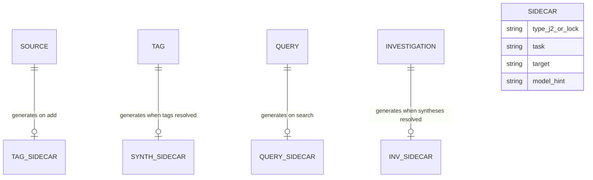
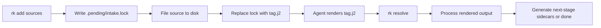

# Sidecar Completion Contract

## Design Intent

**Context:** rk needs intelligence but never calls an LLM. This design defines the on-disk file contract between rk and the calling agent.

### Goals

- Every intelligence request is a file on disk — survives interruptions, visible in git, resumable
- Agents can dispatch sidecar completion to a subagent swarm (parallelizable)
- Sidecars live proximate to their targets
- The template structure tells the agent exactly what output shape rk expects

### Constraints

- Sidecars are Jinja2 templates (`.j2`); rendered output is the completed file (per ADR-002)
- Lock files (`.lock`) signal in-progress operations at a stage
- `rk resolve` is the only consumer of rendered sidecars (per ADR-003)
- `rk doctor` detects stale locks and unresolved sidecars

### Non-goals

- Streaming/real-time completion
- Sidecar format as a stable public API (internal contract, can evolve)
- Encryption or access control on sidecars

## Data Surface

The sidecar completion system — how intelligence requests are represented on disk, rendered by agents, and resolved by rk.

## Entity Model



## Data Flow



## Schema Definitions

### Sidecar location rules

Sidecars live in `.pending/` inside the directory of their target:

| Task | Location | Generated when |
|------|----------|----------------|
| Intake lock | `library/sources/<slug>/.pending/intake.lock` | `rk add` starts filing |
| Tag template | `library/sources/<slug>/.pending/tag.j2` | `rk add` finishes filing (replaces lock) |
| Synthesis template | `tags/<tag-slug>/.pending/synthesize.j2` | All tag sidecars resolved (batch gate) |
| Query template | `queries/<query-id>/.pending/query.j2` | `rk search` starts |
| Investigation template | `investigations/<inv-id>/.pending/synthesize.j2` | All query/synthesis sidecars resolved |

### Lock files

A `.lock` file signals that rk is in the middle of an operation at this stage. Contents are minimal:

```
task: intake
started: 2026-03-30T14:00:00Z
pid: 12345
```

`rk resolve` treats `.lock` files the same as `.j2` files for gate-checking purposes — if any locks exist at the current stage, the gate stays closed.

### Jinja2 template sidecar (`.j2`)

The template contains:
1. **Metadata** in Jinja2 comments: task type, model hint, target entity
2. **Context** in Jinja2 comments: all information the LLM needs (source content, existing tags, etc.)
3. **Output template**: the Jinja2 structure the agent renders with LLM output

Example — tag sidecar:

```jinja2
{# rk:tag | model_hint: medium | target: agent-memory #}
{#
Analyze the content and produce tags.

Existing tags in use: memory, agents, persistence

Content:
# Agent Memory
Three approaches to memory in LLM agents: working memory for current
context, episodic memory for past interactions, and semantic memory
for long-term knowledge.

Rules:
- 3-7 tags, lowercase hyphenated slugs
- Prefer reusing existing tags when they apply
- Avoid overly generic tags like "technology" or "research"
#}
tags:

  - {{ tag }}

```

Agent renders → output:

```yaml
tags:
  - memory
  - llm-architecture
  - persistence
```

Example — synthesis sidecar:

```jinja2
{# rk:synthesize | model_hint: heavy | target: memory #}
{#
Synthesize the following sources about "memory" into thematic markdown.
Organize by theme, not by source. Cite sources by slug in parentheses.
Surface agreements, disagreements, and gaps.

Source: agent-memory
# Agent Memory
Three approaches to memory...

Source: memory-survey
# Survey of Memory Systems
Five memory architectures compared...

Source: working-memory-limits
# Working Memory Constraints
Token windows limit working memory to...
#}
{{ synthesis }}
```

Agent renders → output (plain markdown):

```markdown
# Memory Architectures

Three approaches dominate the literature...

Working memory (agent-memory, working-memory-limits) is constrained by...
```

### Rendered output file

When the agent renders a `.j2` template, it writes the output to the same directory, replacing `.j2` with the appropriate extension:

| Template | Rendered output |
|----------|----------------|
| `tag.j2` | `tag.yaml` |
| `synthesize.j2` | `synthesize.md` |
| `query.j2` | `query.md` |

`rk resolve` looks for rendered output files (not `.j2`). If a `.j2` exists without a matching rendered file, the sidecar is still pending.

### Quality tracking

rk writes quality metadata after processing a rendered sidecar:

```yaml
# library/sources/agent-memory/.pending/tag.meta.yaml (written by rk resolve)
task: tag
target: agent-memory
model_hint: medium
completed_by: claude-sonnet-4   # agent should write this into rendered output or as a comment
resolved: 2026-03-30T14:00:10Z
```

This metadata is transient — deleted with the sidecar after resolution, but visible in git history.

## Evolution Rules

- New sidecar types can be added by defining a new `.j2` template pattern
- Template format can change between rk versions (rk generates them)
- Rendered output format is task-specific and defined by the template
- Old sidecars without new fields are still valid

## Invariants

- A `.pending/` directory with `.lock` or `.j2` files means work is outstanding
- A `.j2` without a matching rendered output file is pending (agent hasn't completed it)
- A rendered output file without a `.j2` has been consumed by `rk resolve` (normal post-resolution state before cleanup)
- `rk resolve` only processes rendered output files, never `.j2` directly
- `rk resolve` deletes `.pending/` contents after successful processing
- Lock files block stage advancement just like unrendered templates
- Source is ALWAYS on disk before any sidecars are generated for it

## Edge Cases and Error States

- **Interrupted during intake:** `.lock` file remains. `rk doctor` detects stale locks (age > threshold), offers cleanup.
- **Agent crashes mid-render:** `.j2` exists without rendered output. Sidecar stays pending. Next agent session picks it up via `rk resolve`.
- **Malformed rendered output:** `rk resolve` attempts best-effort parsing. If unparseable, logs warning and leaves sidecar for manual intervention.
- **Concurrent `rk add`:** Each creates independent `.pending/` dirs in their own source dirs. No collision.
- **Concurrent `rk resolve`:** Lockfile prevents concurrent resolution. Second resolve waits or reports "resolve in progress."
- **Sidecar for deleted source:** `rk resolve` checks target exists, deletes orphaned sidecar if not.

## Design Decisions

1. **Sidecars as files, not ephemeral I/O** — per ADR-001. Durability, git history, parallelism.
2. **Jinja2 templates for output structure** — per ADR-002. Agent knows exactly what shape to produce.
3. **Rendered output replaces `.j2` extension** — simple convention, easy to scan.
4. **Locks for in-progress operations** — prevents `rk resolve` from advancing past incomplete intake.

## Assets

None yet — template examples are inline above.

## Lifecycle

| Phase | Date | Commit | Notes |
|-------|------|--------|-------|
| Active | 2026-03-30 | -- | Rewritten to reflect ADR-001, ADR-002 |
