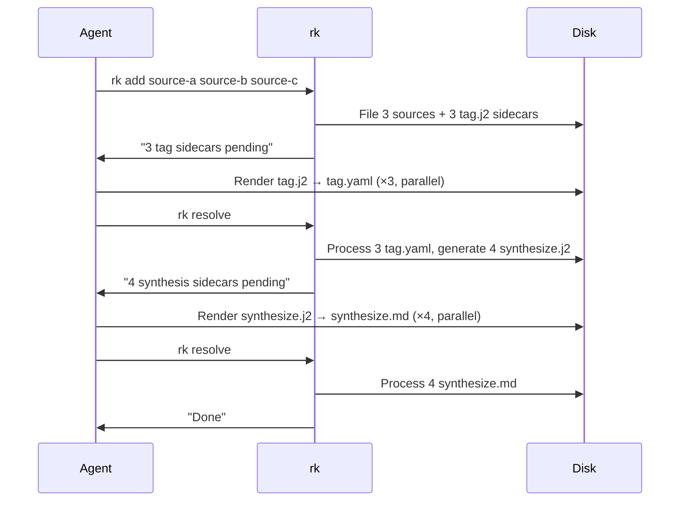

# Pipeline Stages and Batch Gates

## Design Intent

**Context:** rk's pipeline has stages where work is parallelizable and stages where work must wait for all prior work to complete. This design defines the stage sequence, batch gate rules, and `rk resolve` behavior.

### Goals

- Agent's job is simple: fill sidecars, call resolve, repeat until done
- rk owns the pipeline intelligence — agents don't need to know the stage sequence
- Synthesis always sees the complete picture (all sources for a tag)
- Concurrent agents coordinate through the filesystem, not messaging

### Constraints

- Stage advancement is determined by tree scan, not manifests or counters (per ADR-003)
- h Both `.lock` and `.j2` files block stage advancement (per DESIGN-001)
- `rk resolve` takes a lockfile — only one resolve at a time
- `rk add` accepts a list of sources — all are filed before any tagging starts

### Non-goals

- Per-source pipeline (each source running the full chain independently)
- Agent-controlled stage advancement
- Real-time streaming between stages

## Interface Surface

The `rk add` and `rk resolve` CLI commands that drive the staged pipeline.

## Contract Definition

### `rk add <source> [source...]`

Accepts one or more sources (URLs, file paths, inline text).

**Behavior:**
1. For each source: create `.pending/intake.lock` → normalize → file → replace lock with `tag.j2`
2. Return summary listing all filed sources and their pending tag sidecars

**Output:**
```
Added 3 sources:
  agent-memory        library/sources/agent-memory/.pending/tag.j2 (medium)
  rag-overview        library/sources/rag-overview/.pending/tag.j2 (medium)
  vector-search       library/sources/vector-search/.pending/tag.j2 (medium)

3 tag sidecars pending (parallelizable). Run: rk resolve
```

**Guarantees:**
- All sources are on disk before any tag sidecars are generated
- Each source's `.pending/tag.j2` exists before the command returns
- Duplicate sources (by content hash) are skipped with a message

### `rk resolve`

The pipeline state machine. Each call processes what's ready, reports what's next.

**Algorithm:**

```
1. Acquire resolve lockfile (fail if held by another process)
2. Scan entire tree for rendered output files → process each:
   - tag.yaml  → create tags, symlinks, update manifest
   - synthesize.md → write synthesis.md, update meta.yaml, embed
   - query.md → write query synthesis, index
   - Delete .pending/ contents after processing
3. Determine current stage by scanning for pending work:
   a. Any .lock files anywhere? → report "intake in progress, waiting"
   b. Any .pending/tag.j2 without tag.yaml? → report pending tags, STOP
   c. Zero pending tags? → BATCH GATE: generate synthesis sidecars
      for all tags that have new sources since last synthesis
   d. Any .pending/synthesize.j2 without synthesize.md? → report pending syntheses, STOP
   e. Zero pending syntheses? → BATCH GATE: generate investigation
      sidecars if applicable
   f. Nothing pending? → "Done. All sources tagged and synthesized."
4. Release resolve lockfile
```

**Output (example — tags pending):**
```
Resolved 0 sidecars (none completed yet).

Stage: tagging
3 tag sidecars pending (parallelizable):
  library/sources/agent-memory/.pending/tag.j2 (medium)
  library/sources/rag-overview/.pending/tag.j2 (medium)
  library/sources/vector-search/.pending/tag.j2 (medium)

Fill these sidecars, then run: rk resolve
```

**Output (example — tags done, synthesis generated):**
```
Resolved 3 tag sidecars:
  agent-memory → memory, llm-architecture
  rag-overview → memory, retrieval
  vector-search → retrieval, embeddings

Stage: synthesis
4 synthesis sidecars generated (parallelizable):
  tags/memory/.pending/synthesize.j2 (heavy) — 4 sources
  tags/llm-architecture/.pending/synthesize.j2 (heavy) — 1 source
  tags/retrieval/.pending/synthesize.j2 (heavy) — 2 sources
  tags/embeddings/.pending/synthesize.j2 (heavy) — 1 source

Fill these sidecars, then run: rk resolve
```

**Output (example — all done):**
```
Resolved 4 synthesis sidecars.

Done. 3 sources added, 4 tags updated, 4 syntheses current.
```

### `rk search <query>`

Follows the same pattern for query synthesis:
1. Retrieve sources via FTS/semantic search
2. Generate `queries/<id>/.pending/query.j2` with retrieved sources as context
3. Return the sidecar path for the agent to fill
4. Agent fills, calls `rk resolve` to finalize the query



## Behavioral Guarantees

### Stage order (per ADR-003)

| Stage | Parallelizable | Gate condition to advance |
|-------|---------------|--------------------------|
| 1. Intake | Yes (each source independent) | All `.lock` files cleared, all `tag.j2` generated |
| 2. Tagging | Yes (each source's tags independent) | Zero `tag.j2` without `tag.yaml` anywhere in tree |
| 3. Synthesis | Yes (each tag's synthesis independent) | Zero `synthesize.j2` without `synthesize.md` anywhere |
| 4. Query/Investigation | Yes | Zero `query.j2`/`synthesize.j2` pending |

### Locking

- `rk resolve` acquires `.rk-resolve.lock` at the library root
- If locked, resolve exits with: "Resolve in progress (PID: <pid>). Try again shortly."
- Lock includes PID and timestamp for stale lock detection by `rk doctor`

### Concurrent agents

Two agents adding to the same library:
- Both `rk add` — each creates its own source dirs and tag sidecars. No collision.
- Agent A calls `rk resolve` while agent B is still filling tags — resolve sees B's unfilled sidecars, reports them as pending, does not advance to synthesis.
- Agent B finishes, calls `rk resolve` — all tags now resolved, synthesis sidecars generated.

The filesystem is the coordination mechanism. No agent needs to know about the other.

## Integration Patterns

### Agent workflow (primary)

```
agent runs: rk add <sources>
agent reads: output listing sidecars + model hints
agent dispatches: subagent swarm to fill sidecars in parallel
agent runs: rk resolve
agent reads: output — either more sidecars or "done"
repeat until done
```

### Pipeline/automation workflow

```
cron: rk add <sources from queue> --no-prompt
cron: # sidecars sit pending until an agent session
agent session: rk resolve
agent: fills sidecars, resolves, repeat
```

### MCP workflow

```
client calls: rk_add tool with sources
rk returns: filed sources + sidecar paths + model hints
client completes: fills sidecars (or dispatches to capable model)
client calls: rk_resolve tool
rk returns: next sidecars or done
```

## Evolution Rules

- New pipeline stages can be added by defining new sidecar types and gate conditions
- Stage order is defined in `rk resolve` logic, not in configuration
- New gate conditions follow the same pattern: "any pending X? → don't advance"

## Edge Cases and Error States

- **`rk add` interrupted mid-batch:** Some sources filed, some not. `.lock` files remain for incomplete sources. `rk resolve` sees locks, reports "intake in progress." `rk doctor` detects stale locks.
- **Agent fills some sidecars but not all:** `rk resolve` processes completed ones, reports remaining pending ones. No stage advancement until all are done.
- **Stale sidecar (agent abandoned):** `rk doctor` detects sidecars older than a configurable threshold, reports them. Operator can re-dispatch or delete.
- **Synthesis sidecar generated but tag changes arrive:** Shouldn't happen — batch gate prevents new tag sidecars while synthesis is pending. If a new `rk add` runs during synthesis, its tag sidecars will be visible and block the NEXT synthesis cycle.
- **Empty tag (all sources removed):** `rk resolve` skips synthesis for tags with zero sources.

## Design Decisions

1. **Tree scan, not manifests** — per ADR-003. Disk state is truth. Concurrent agents coordinate naturally.
2. **`rk resolve` as state machine tick** — agent doesn't need to know the stage sequence. Just call resolve and do what it says.
3. **Locks and templates both block gates** — per DESIGN-001. Intake in progress is as blocking as unfinished tagging.
4. **`rk add` accepts a list** — all intake completes before tagging starts, giving the batch gate a clean starting state.

## Assets

None yet.

## Lifecycle

| Phase | Date | Commit | Notes |
|-------|------|--------|-------|
| Active | 2026-03-30 | -- | Initial creation — reflects ADR-001, ADR-002, ADR-003 |
