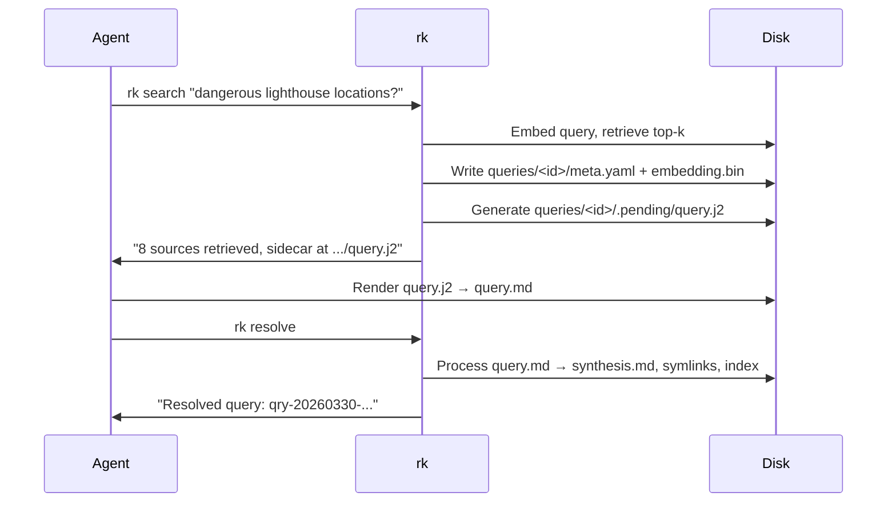

# Query Sidecar and Search Synthesis

## Design Intent

**Context:** `rk search` is the primary read path — the command users reach for when they want to know what their library says about a topic. Like `rk add`, search produces a sidecar for the agent to fill. rk handles retrieval and scoring; the agent provides synthesis. This design defines the system contract for `rk search`: how queries enter the system, how retrieval works, how the sidecar is structured, how results are persisted, and how it integrates with the resolve cycle from [DESIGN-002](../(DESIGN-002)-Pipeline-Stages-And-Batch-Gates.md).

### Goals

- `rk search` follows the same sidecar pattern as `rk add` — rk generates a query.j2, the agent fills it, `rk resolve` finalizes
- Retrieval is always rk's job — the scoring algorithm (semantic similarity x freshness decay) is deterministic and rk-owned
- Query results are first-class knowledge nodes — persisted, indexed, citable in future searches
- The sidecar contract follows [DESIGN-001](../(DESIGN-001)-Sidecar-Completion-Contract.md) (Jinja2 templates, `.pending/` directories, `rk resolve` as consumer)

### Constraints

- Query sidecars live at `queries/<query-id>/.pending/query.j2` (per [DESIGN-001](../(DESIGN-001)-Sidecar-Completion-Contract.md) location rules)
- `rk resolve` is the only consumer of rendered query sidecars (per [ADR-003](../../../adr/Active/(ADR-003)-Staged-Pipeline-With-Batch-Gates.md))
- Freshness weighting uses exponential decay with configurable half-life (per `rk.yaml` config)
- Retrieval searches both source nodes and tag-synthesis nodes — queries search the full knowledge graph
- Query persistence follows the QueryStore contract ([SPEC-011](../../../spec/Active/(SPEC-011)-QueryStore-Filesystem-Adapter.md)): `synthesis.md`, `meta.yaml`, `embedding.bin`, symlinks to cited sources and tags

### Non-goals

- Direct-mode synthesis (synthesizer calling an LLM inline) — post-v1
- MCP tool contract for search — post-v1
- Query-to-query similarity (reusing past query answers) — future work
- Agent-controlled retrieval parameters (rk owns scoring)
- Incremental re-synthesis when library changes after a query is persisted

## Interface Surface

The `rk search` CLI command and its integration with `rk resolve` for query sidecar completion.

## Contract Definition

### `rk search <query> [--top-k N] [--investigation ID]`

`rk search` performs retrieval and generates a sidecar for the agent to fill:

1. **Embed** the query text via the configured embedder
2. **Retrieve** top-k nodes by `score = cosine_similarity(query_embedding, node_embedding) * freshness_weight(node)`
3. **Create** query directory: `queries/<id>/`
4. **Write** `meta.yaml` with query text, retrieval results, and scoring metadata
5. **Write** `embedding.bin`
6. **Generate** `queries/<id>/.pending/query.j2` with retrieved sources as context
7. **Return** the sidecar path and retrieval summary

**Output:**
```
--- Query: Which Maine lighthouses had the most dangerous locations? ---

Retrieved 8 sources (top-k=20, 8 above threshold):
  seguin-island-light     score=0.87 (sim=0.92, fresh=0.95)
  whaleback-ledge-light   score=0.84 (sim=0.91, fresh=0.92)
  petit-manan-light       score=0.81 (sim=0.88, fresh=0.92)
  keeper-abbie-burgess    score=0.74 (sim=0.82, fresh=0.90)
  lighthouse-shipwreck-coast score=0.71 (sim=0.79, fresh=0.90)
  ...

Sidecar: queries/qry-20260330-dangerous-lighthouse-locations/.pending/query.j2 (heavy)

Fill the sidecar, then run: rk resolve
```

**Guarantees:**
- Query directory and `meta.yaml` exist before the sidecar is written
- The sidecar includes all retrieved source content as context (not just slugs)
- Retrieval scores are persisted in `meta.yaml` for reproducibility

### Query sidecar template

Follows the [DESIGN-001](../(DESIGN-001)-Sidecar-Completion-Contract.md) Jinja2 template contract:

```jinja2
{# rk:query | model_hint: heavy | target: qry-20260330-dangerous-lighthouse-locations #}
{#
Synthesize an answer to the following question using ONLY the sources below.
Organize by theme, not by source. Cite sources by slug in parentheses.
Surface agreements, disagreements, and gaps.

Question: Which Maine lighthouses had the most dangerous locations and why?

Source: seguin-island-light (score: 0.87)
# Seguin Island Light
Seguin Island's danger was a combination of isolation, extreme weather...

Source: whaleback-ledge-light (score: 0.84)
# Whaleback Ledge Light
Whaleback Ledge represents a different category of danger...

Source: petit-manan-light (score: 0.81)
# Petit Manan Light
Petit Manan's danger stems from its extreme exposure...

Source: keeper-abbie-burgess (score: 0.74)
# Keeper Abbie Burgess
By most accounts, Matinicus Rock was the single most dangerous posting...

[additional sources...]
#}
{{ synthesis }}
```

Agent renders -> output (`query.md`):

```markdown
Several Maine lighthouses stand out for the extreme hazards of their
locations, each dangerous for distinct but overlapping reasons...

The common thread across these stations (seguin-island-light,
whaleback-ledge-light, petit-manan-light) is the convergence of
multiple hazards: open Atlantic exposure, submerged rocks, and fog...
```

### `rk resolve` integration

When `rk resolve` encounters a rendered `query.md` in a query's `.pending/` directory:

1. Read `query.md` (the synthesis)
2. Write `queries/<id>/synthesis.md` from the rendered content
3. Create symlinks to cited sources and tags (extracted from synthesis citations)
4. Index the query node in SQLite with `kind="query-synthesis"`
5. Store edges from query to cited sources/tags
6. Delete `.pending/` contents
7. Report: `"Resolved query: qry-20260330-dangerous-lighthouse-locations"`

**Stage placement:** Query resolution happens at Stage 4 in the [DESIGN-002](../(DESIGN-002)-Pipeline-Stages-And-Batch-Gates.md) pipeline (Query/Investigation stage). Query sidecars do not block earlier stages — they are independent of the intake-tag-synthesis pipeline.



## Behavioral Guarantees

### Retrieval algorithm

Scoring combines semantic similarity with freshness decay:

```
score = cosine_similarity(query_embedding, node_embedding) * freshness_weight(node)
```

Where:
- `cosine_similarity` operates on float32 embedding blobs
- `freshness_weight = 2^(-age_days / half_life_days)` — exponential decay, returns 0.0-1.0
- `half_life_days` defaults to 30, configurable via `rk.yaml` → `freshness.default_ttl`
- Nodes with no embedding are excluded from semantic search

**What gets searched:**

| Node kind | Indexed | Searchable | Notes |
|-----------|---------|------------|-------|
| `source` | Yes | Yes | Raw source content |
| `tag-synthesis` | Yes | Yes | Tag synthesis documents |
| `query-synthesis` | Yes | No (future) | Past query results — not yet searched |
| `investigation` | Yes | No (future) | Investigation syntheses — not yet searched |

Retrieval returns all node kinds with embeddings, sorted by score, truncated to top-k.

### Query ID format

`qry-YYYYMMDD-<slug>` where slug is derived from the query text (lowercased, hyphenated, truncated to 50 chars). Per [SPEC-011](../../../spec/Active/(SPEC-011)-QueryStore-Filesystem-Adapter.md).

### Persistence contract

On-disk state after `rk resolve` processes the query sidecar:

```
queries/qry-20260330-dangerous-lighthouse-locations/
  synthesis.md          # The answer
  meta.yaml             # Query text, cited sources, scores, timestamps
  embedding.bin         # Query embedding (float32 blob)
  sources/
    seguin-island-light -> ../../../library/sources/seguin-island-light
    whaleback-ledge-light -> ../../../library/sources/whaleback-ledge-light
    ...
  tags/
    shipwrecks -> ../../../tags/shipwrecks
    island-lighthouses -> ../../../tags/island-lighthouses
```

### `meta.yaml` schema

```yaml
query: "Which Maine lighthouses had the most dangerous locations and why?"
slug: qry-20260330-dangerous-lighthouse-locations
created: 2026-03-30T14:00:00Z
top_k: 20
retrieval:
  - slug: seguin-island-light
    kind: source
    score: 0.87
    similarity: 0.92
    freshness_weight: 0.95
  - slug: whaleback-ledge-light
    kind: source
    score: 0.84
    similarity: 0.91
    freshness_weight: 0.92
cited_sources:
  - seguin-island-light
  - whaleback-ledge-light
  - petit-manan-light
cited_tags:
  - shipwrecks
  - island-lighthouses
investigation: null  # or investigation ID if linked
```

### Investigation linking

When `--investigation <id>` is passed:
- The query is linked to the investigation via `InvestigationStore.link(inv_id, query_id, "query")`
- The investigation's rolling synthesis will include this query's results

### Concurrent search

Multiple `rk search` calls can run concurrently:
- Each creates its own `queries/<id>/` directory with a unique timestamp-based ID
- No resolve lock needed for the retrieval+sidecar generation phase
- Both sidecars can be filled in parallel by the agent
- `rk resolve` processes them sequentially (resolve lock applies)

## Integration Patterns

### Agent workflow (primary path)

```
agent runs: rk search "what do I know about X?"
agent reads: retrieval summary + sidecar path
agent renders: fills query.j2 with LLM synthesis
agent runs: rk resolve
agent reads: "Resolved query: qry-..."
```

This follows the same loop as `rk add` → fill sidecars → `rk resolve`. The agent doesn't need to know it's a different pipeline stage — it's always "fill the sidecar, call resolve."

### Pipeline integration

Search is independent of the intake-tag-synthesis pipeline. An agent can:
- Run `rk search` at any time, even while intake/tagging is in progress
- Search results reflect whatever is currently indexed (may not include in-progress sources)
- After intake-tag-synthesis completes, re-running the same search may return different results (new sources indexed)

## Evolution Rules

- **Direct-mode synthesis** (configured API calls LLM inline) can be added post-v1 as an alternative synthesis path — same retrieval, same persistence, no sidecar step
- **MCP tool contract** for search can wrap `rk search` + `rk resolve` into a single tool call post-v1
- New retrieval strategies (BM25, hybrid) can be added alongside semantic search
- The scoring formula can evolve (e.g., adding recency boost, source-type weighting)
- Query-to-query similarity (searching past answers) is a natural extension
- `meta.yaml` fields can be added; old queries without new fields remain valid

## Edge Cases and Error States

- **No embedder configured:** `rk search` fails with: "Search requires an embedder. Configure one in rk.yaml or install ollama."
- **Embedder fails at query time:** Return error. No sidecar generated, no query persisted.
- **No results (empty library or no matches):** Persist a query node with a sidecar whose context says "no sources matched." The agent can still synthesize a "nothing found" response, maintaining the uniform sidecar flow.
- **Agent abandons sidecar:** `query.j2` remains in `.pending/`. `rk doctor` detects stale sidecars. `rk resolve` reports it as pending. Another agent session can pick it up.
- **Duplicate query text:** Each search creates a new query node (different timestamp = different ID). Past queries are not deduplicated — they represent distinct moments of asking.
- **Library changes between retrieval and synthesis:** The sidecar contains the retrieved content at query time. If sources change before the agent fills the sidecar, the synthesis will be based on the original retrieval. This is acceptable — the sidecar is a snapshot.
- **Citation extraction from synthesis:** `rk resolve` extracts cited slugs from the synthesis text (parenthetical references like `(seguin-island-light)`). If the agent's synthesis doesn't cite sources in the expected format, symlinks may be incomplete. The `query.j2` template instructions specify the citation format.

## Design Decisions

1. **Sidecar-only for v1** — rk is agent-native. The sidecar path is the differentiator. Direct-mode synthesis (LLM called inline) is a post-v1 optimization for non-agent consumers. Designing for one mode keeps the contract simple and testable.
2. **rk owns retrieval, agent owns synthesis** — The scoring algorithm is deterministic and reproducible. Synthesis requires intelligence. This split keeps rk's promises testable and the agent's job clear.
3. **Retrieval scores in meta.yaml** — Persisting scores makes queries reproducible and debuggable. An operator can see why certain sources were retrieved and whether freshness weighting is behaving as expected.
4. **Query sidecars at Stage 4** — Queries don't block intake/tagging/synthesis. They're independent read operations that can happen at any time. This matches the intuition that "searching your library" shouldn't wait for "filing new material."
5. **No query deduplication** — Asking the same question twice at different times should give different answers (new sources may exist). Each query is a timestamped snapshot.

## Assets

None yet.

## Lifecycle

| Phase | Date | Commit | Notes |
|-------|------|--------|-------|
| Active | 2026-03-30 | -- | Initial creation — system contract for rk search |
| Active | 2026-03-30 | -- | Simplified to sidecar-only for v1; direct mode deferred to post-v1 |
