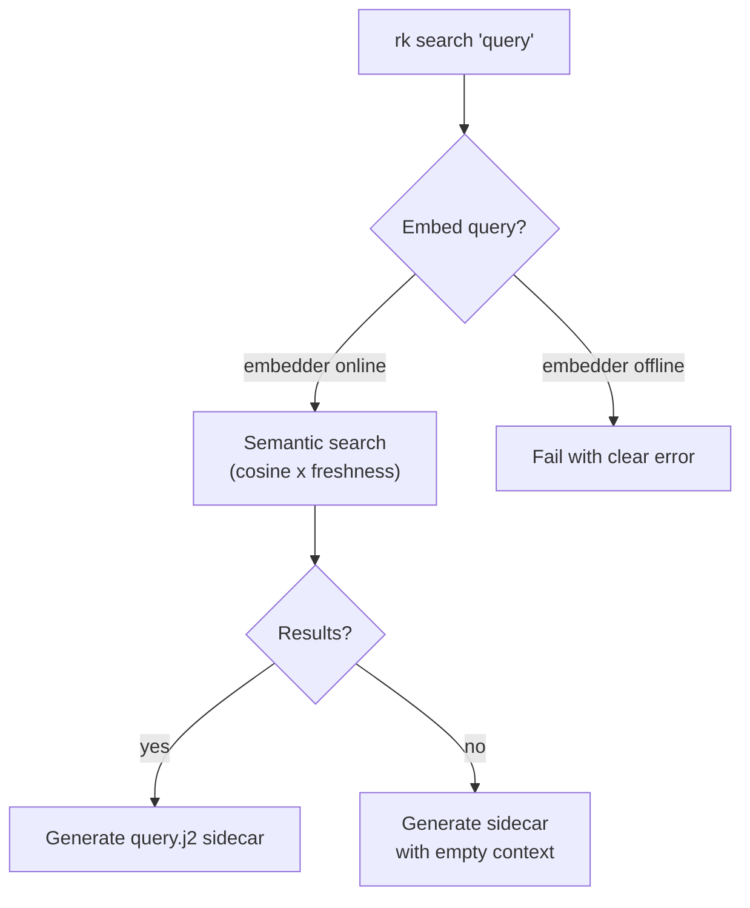

# Embedding Backfill and Search Degradation

## Design Intent

**Context:** The intake pipeline (`rk add`) and the search pipeline (`rk search`) have different dependencies on the embedder. Intake works fine without it — sources are filed, tag sidecars generated, synthesis proceeds. But search requires embeddings for semantic retrieval. When the embedder (ollama) is offline at capture time, sources enter the library without embeddings. When ollama comes back online, those sources are invisible to semantic search until their embeddings are backfilled. This design defines how rk handles the gap: what happens at capture time, how backfill works, and how search degrades gracefully when embeddings are unavailable.

### Goals

- `rk add` never fails because the embedder is offline — sources are filed and the sidecar pipeline proceeds normally
- Sources without embeddings are discoverable via `rk search` through FTS fallback
- `rk resolve` or `rk rebuild` backfills missing embeddings when the embedder comes back online
- The operator always knows what state their library is in — `rk doctor` reports sources missing embeddings

### Constraints

- Embedding is rk's responsibility, not the agent's — it's deterministic, not creative (per [ADR-004](../../../adr/Active/(ADR-004)-V1-Agent-Runtime-Environment-Model.md))
- Backfill uses the same embedder configuration as initial embedding — no separate config
- FTS fallback produces the same sidecar format as semantic search — the agent doesn't need to know which retrieval method was used
- `rk rebuild` is the explicit backfill trigger — no background processes, no implicit re-embedding

### Non-goals

- Multiple embedding models / re-embedding when the model changes — future work
- Partial embedding (embedding only the first N tokens) — always embed full content
- Embedding quality scoring or validation
- Real-time embedding on add (if ollama is available, embed eagerly — but don't block on it)

## Interface Surface

Three integration points: the intake pipeline's embedding behavior, the search pipeline's retrieval fallback, and the rebuild/doctor commands' backfill and reporting.

## Contract Definition

### Capture time: `rk add` with embedder offline

When `rk add` files a source and the embedder is unavailable:

1. Source is filed normally (content, manifest, content hash)
2. Source is indexed in SQLite (node row, FTS entry) — **without** an embedding
3. Tag sidecar is generated normally
4. CLI output includes a note: `"(embedding skipped — embedder unavailable)"`

The source is fully functional for the sidecar pipeline (tagging, synthesis). It's just invisible to semantic search until backfilled.

**Current behavior:** `rk add` calls `embedder.embed()` and stores the result. If the embedder raises, the embedding is silently skipped (the source is still filed). This is already correct — the design formalizes it.

### Search time: `rk search` with missing embeddings

When `rk search` runs and encounters issues:

**Scenario A — Embedder offline (can't embed the query):**

Fail with a clear error: `"Error: <embedder error message>"`. Do not degrade to keyword search — FTS-only results are keyword-matched, not semantically relevant, and produce misleading synthesis. The fix is to start ollama or run `rk rebuild` when it's back.

> **Why not FTS fallback?** FTS uses implicit AND and matches tokens, not meaning. "Dangerous lighthouses" won't match a source about "hazardous coastal conditions." Giving the agent irrelevant sources to synthesize from is worse than failing clearly. FTS may return as a scoring factor in hybrid retrieval (boosting semantic candidates that also have keyword matches), but not as a standalone fallback.

**Scenario B — Embedder online but some sources lack embeddings:**

Semantic search proceeds normally. Sources without embeddings are simply absent from semantic results (they have no entry in the `embeddings` table). This is the expected gap that backfill closes.

The sidecar is generated with whatever semantic search returns. The agent synthesizes from what's available. The operator may not even notice — unless they know a source should have matched.

**Scenario C — No results from semantic search:**

Generate the sidecar with empty source context. The `query.j2` template still contains the question. The agent can synthesize a "no sources found" response. This is already handled by [DESIGN-003](../(DESIGN-003)-Query-Sidecar-And-Search-Synthesis/(DESIGN-003)-Query-Sidecar-And-Search-Synthesis.md).



### Backfill: `rk rebuild`

`rk rebuild` already reconstructs the SQLite index from the filesystem. Extend it to backfill missing embeddings:

1. For each source in `library/sources/`:
   - Check if an embedding exists in the `embeddings` table
   - If not, and the embedder is available, call `embedder.embed(source.content)` and store it
   - If the embedder is unavailable, skip with a warning
2. Report: `"Backfilled embeddings for N source(s). M source(s) still missing (embedder unavailable)."`

This is idempotent — running rebuild twice doesn't re-embed sources that already have embeddings.

**Tag synthesis nodes** also need embeddings for search to find them. The same backfill logic applies: for each tag with a `synthesis.md`, check for an embedding and generate one if missing.

### `rk resolve` embedding behavior

When `rk resolve` processes a completed sidecar and the result produces a new knowledge node (tag synthesis, query synthesis):

- If the embedder is available, embed the new content and store it
- If the embedder is unavailable, skip embedding — the node is still created and indexed via FTS
- Backfill will catch it on the next `rk rebuild`

### `rk doctor` reporting

`rk doctor` should report embedding coverage:

```
Embeddings: 47/52 sources embedded, 8/8 tag syntheses embedded, 3/3 queries embedded
  5 sources missing embeddings (run rk rebuild to backfill)
```

If all nodes have embeddings: silent (no line in doctor output).

## Behavioral Guarantees

### Embedding is best-effort at capture time, guaranteed at rebuild time

| Operation | Embedder online | Embedder offline |
|-----------|----------------|-----------------|
| `rk add` | Embed eagerly | File source, skip embedding |
| `rk resolve` (tag synthesis) | Embed new synthesis | Create node, skip embedding |
| `rk resolve` (query) | N/A (query already embedded at search time) | N/A |
| `rk search` | Semantic search | FTS fallback |
| `rk rebuild` | Backfill all missing | Report count, skip |
| `rk doctor` | Report coverage | Report coverage |

### FTS fallback scoring

FTS results don't have cosine similarity. To produce `ScoredNode` objects compatible with the sidecar generator:

| Field | Semantic value | FTS fallback value |
|-------|---------------|-------------------|
| `similarity` | cosine(query, node) | `0.0` |
| `freshness_weight` | `2^(-age/half_life)` | `2^(-age/half_life)` (same formula) |
| `score` | `similarity × freshness_weight` | `freshness_weight` (freshness only) |

This means FTS results are ranked purely by freshness — newer sources appear first. This is a reasonable default when we have no semantic signal.

### Sidecar format is identical

The `query.j2` sidecar generated from FTS results looks exactly the same as one from semantic results. The only difference is in `meta.yaml`:
- Semantic: `retrieval[].similarity` is a real cosine value
- FTS: `retrieval[].similarity` is `0.0`

The agent doesn't need to know or care which retrieval method produced the sidecar.

## Integration Patterns

### Agent workflow — nothing changes

The agent's loop is unchanged regardless of embedding state:
```
agent runs: rk search "question"
agent reads: retrieval summary + sidecar path
agent fills: query.j2 -> query.md
agent runs: rk resolve
```

If the results came from FTS instead of semantic search, the agent may get less relevant sources — but the workflow is identical.

### Backfill after offline period

```
# Ollama was offline for a week, sources were added without embeddings
agent runs: rk rebuild
# "Backfilled embeddings for 15 source(s)"
# Now semantic search works against all sources
agent runs: rk search "question"
# Full semantic results
```

## Evolution Rules

- If a new embedding model is configured, `rk rebuild --force-embed` could re-embed everything (future work)
- Hybrid retrieval (FTS + semantic combined) could use FTS as a candidate set filter before semantic scoring
- Embedding model metadata could be stored per-node to detect model changes

## Edge Cases and Error States

- **Embedder intermittently available:** Some sources get embeddings, some don't. Semantic search returns partial results. `rk doctor` reports the gap. `rk rebuild` closes it.
- **Embedding model changes between add and rebuild:** Old embeddings use the old model's vector space. New embeddings use the new model's. Cosine similarity across models is meaningless. For v1, we don't track which model produced each embedding — `rk rebuild --force-embed` (future) would be the fix.
- **FTS query syntax errors:** SQLite FTS5 has its own query syntax. If the user's query contains FTS special characters (`*`, `"`, `NEAR`), the FTS query may fail. Catch the exception and return empty results rather than crashing.
- **Source content changes after embedding:** If a source is re-added or updated, its embedding becomes stale. `rk rebuild` re-embeds from current content, fixing the drift.
- **Very large library, slow backfill:** Embedding 1000 sources takes time. `rk rebuild` should report progress: `"Embedding 47/1000..."` (future enhancement — v1 can just run silently).

## Design Decisions

1. **Best-effort at capture, guaranteed at rebuild** — Embedding shouldn't gate the intake pipeline. Sources are useful for tagging and synthesis without embeddings. The operator can backfill when convenient.
2. **Fail clearly, don't degrade misleadingly** — FTS-only search was implemented and reverted. Keyword matching produces confidently wrong results — "dangerous lighthouses" misses sources about hazardous conditions. Giving the agent irrelevant sources to synthesize from is worse than a clear error. FTS may return as a scoring boost in hybrid retrieval, but not as a standalone fallback.
3. **`rk rebuild` as explicit trigger** — No background embedding, no implicit re-embedding. The operator controls when expensive work happens. This keeps rk predictable and avoids surprise ollama calls.
4. **Embedding is the gate for search, not for intake** — `rk add` works without embeddings. `rk search` requires them. This asymmetry is intentional — filing sources should never be blocked, but searching should be accurate or not happen at all.

## Assets

None yet.

## Lifecycle

| Phase | Date | Commit | Notes |
|-------|------|--------|-------|
| Active | 2026-03-31 | -- | Initial creation — embedding backfill and search degradation contract |
