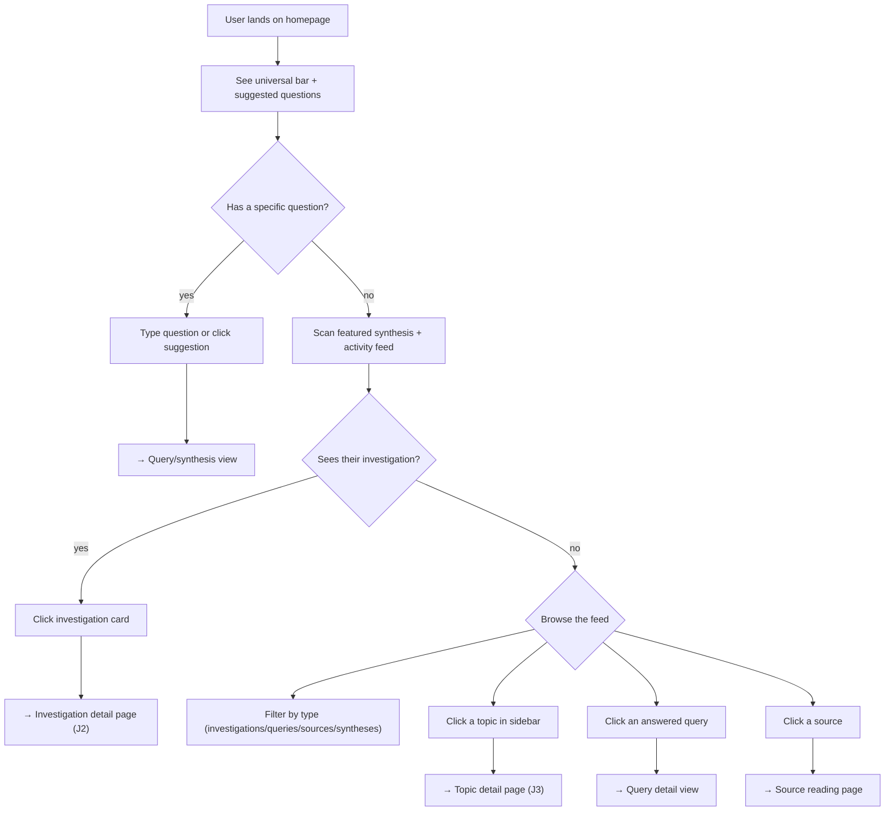

# Homepage Information Architecture

## Design Intent

**Context:** The rk viewer homepage serves as a routing surface for four user journeys — exploring a topic (J1), picking up an investigation (J2), browsing the knowledge base (J3), and adding new material (J4) — while also functioning as a serendipity surface where the knowledge base presents itself.

### Goals

- The homepage answers "what do I want to do right now?" and routes to the right mode
- J3 (browse/serendipity) IS the ambient content of the homepage — featured synthesis, investigations, topics, activity feed are all facets of the KB making itself visible
- J1 (explore) has a prominent entry point via the universal search/capture bar
- J2 (pick up investigation) is served by investigation cards appearing in the activity flow
- J4 (add material) is signaled by "new" badges and recent source additions in the flow
- The experience feels like a living, growing knowledge base — not a static dashboard

### Constraints

- Read-only viewer in phase 1 — no editing, no live agent session
- Must render from rk's git-backed data directory without a separate database
- WCAG AA compliance required
- Light mode, warm off-white (#f7f6f3), Georgia/serif for reading text, system sans-serif for UI chrome
- Must work at knowledge base sizes from 10 to 1000+ sources

### Non-goals

- Not a dashboard with analytics/stats (that belongs in an admin section)
- Not a wiki with editable pages
- Not a chat interface (that's phase 3, companion mode)
- Graph visualization is not on the homepage (may appear on topic detail pages)

## Interaction Surface

The homepage of the rk viewer web application. This is the default landing page and the primary entry point for all four user journeys. It must serve both new visitors ("what's in here?") and returning users ("what's happened since I was last here?").

## User Flow

The homepage has three zones, top to bottom:

### Zone 1: Universal Bar (J1 door)

1. User sees a full-width input bar: "Ask a question, paste a URL to capture, or search your knowledge base..."
2. Below it, a single row of 4 suggested question cards (varied topics, sourced from tag syntheses frontmatter)
3. If user types a question, routes to query/synthesis view
4. If user pastes a URL, routes to capture workflow (phase 2+, shows "open CLI to capture" in phase 1)
5. If user types keywords, routes to search results

### Zone 2: Featured Synthesis (J3 — serendipity)

6. A prominent card shows the most recently updated synthesis (preferably from an active investigation)
7. Shows: label ("Latest synthesis"), investigation pill, headline in Georgia serif, 2-3 sentence excerpt, "Continue reading" link

### Zone 3: Activity Flow + Reference Sidebar (J3 body, J2/J4 doors)

8. Feed filter pills: All / Investigations / Queries / Sources / Syntheses (type filter only, no topic filter)
9. Left column (wider, ~60%): chronological activity feed mixing investigation cards, answered query cards, source cards, and synthesis update cards. Each type has its own visual treatment but they flow together as one stream.
10. Right column (~40%): Topics card (navigational — clicking a tag goes to the topic detail page, bar chart shows relative size, filter input) + Recent Sources card (condensed chronological list)

### Decision Spine

## Screen States

1. **Full KB** (normal) — all zones populated. Feed has a mix of recent activity.
2. **Empty KB** — no sources, no tags, no investigations. Universal bar still shows. Featured synthesis is absent. Feed shows a welcome message: "Your knowledge base is empty. Add your first source via `rk add <url>` to get started."
3. **Sparse KB** — few sources (< 10). Featured synthesis may be absent. Suggested questions not yet available (not enough data). Feed is short. Topics list shows few entries.
4. **Active session** (phase 3, future) — a "Live session" indicator appears in the nav bar. Activity feed updates in real-time. The workbench chat pane slides in from the left.

## Edge Cases and Error States

- **Stale synthesis:** If the featured synthesis hasn't been regenerated since new sources were added, show a subtle "may be out of date" indicator.
- **No investigations:** The investigation cards simply don't appear in the feed. No empty state needed — the feed still has queries and sources.
- **Many investigations:** If > 5 active investigations, the feed may be dominated by them. The type filter ("Queries" / "Sources") lets the user refocus.
- **URL in universal bar:** In phase 1, show a tooltip: "To capture this URL, run `rk add <url>` in your terminal." In phase 3, triggers the capture workflow.

## Design Decisions

1. **Universal bar is search + capture, not just search.** This anticipates phase 2-3 where the viewer becomes a companion. The input detects URLs vs text automatically.
2. **Activity feed mixes types chronologically** rather than grouping by type. This supports serendipity — you see what's happening across the whole KB, not siloed views. Type filters are available for when you want to focus.
3. **Topics sidebar clicks navigate to topic page** (not filter the feed). This keeps two different interactions (filter feed vs navigate to page) visually and spatially distinct.
4. **No topic filter on the feed.** If you want topic-scoped activity, go to the topic page. This avoids confusion between the topic sidebar (navigational) and feed filters (type-based).
5. **Featured synthesis is from most recent investigation** when available, falling back to most recently updated tag synthesis. This surfaces active work first.
6. **Georgia serif for reading text, system sans for UI.** This creates a clear visual hierarchy between content (readable, editorial) and chrome (functional, compact).

## Assets

- `v10-fluid.html` — approved prototype (in `.superpowers/brainstorm/` session directory)
- Earlier iterations: v8-homepage.html, v9-fluid.html (in same directory)
