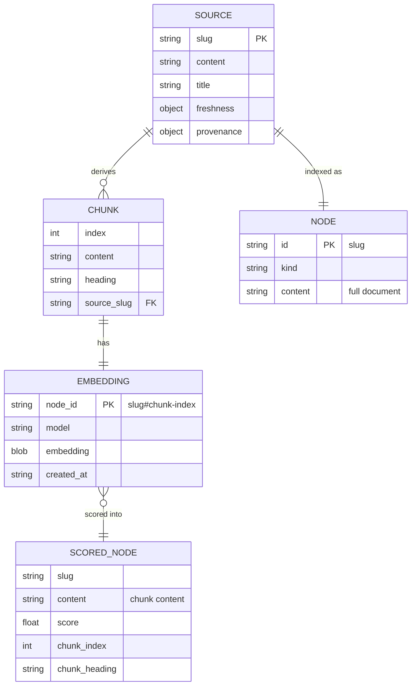
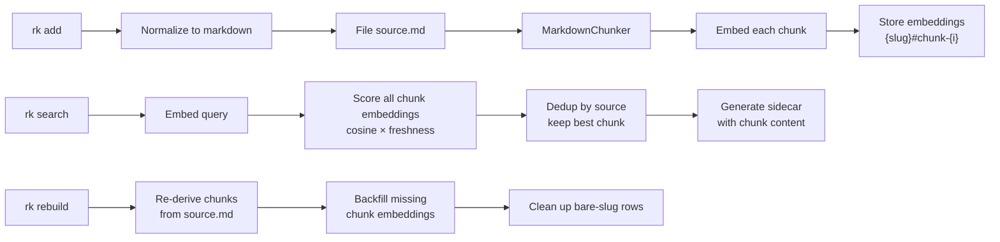

# Chunk Embedding Pipeline

## Design Intent

**Context:** research-keeper embeds one vector per whole source document. As the library grows to include papers, transcripts, and long-form content, single-document embeddings lose signal about specific sections. This design introduces heading-based semantic chunking with paragraph-grouping fallback, so search returns the relevant section of a long document rather than a diluted whole-document match.

### Goals

- Improve search recall for long documents by embedding semantically meaningful sections independently
- Preserve current behavior for short sources — a source under 800 words produces a single chunk identical to today's whole-document embedding
- Keep the filesystem clean — chunks are a search optimization derived at ingestion time, not a new storage layer

### Constraints

- Chunks are derived from `source.md` content, never persisted as separate files
- The `nodes` table schema is unchanged — one row per source
- The `embeddings` table schema is unchanged — chunk-qualified IDs use `{slug}#chunk-{index}` convention
- FTS5 continues to index full document content, not individual chunks
- Tag synthesis and query synthesis nodes are not chunked

### Non-goals

- Two-tier embedding (whole-doc + chunks) — one embedding level only
- Configurable chunking strategy per source or content type
- Chunk-level metadata (freshness, provenance, tags) — chunks inherit from the source
- Multiple embedding models or re-embedding on model change

## Data Surface

Chunk embedding extends the existing embedding lifecycle (DESIGN-004) with a chunking layer between source content and embedding storage. The data domain is: markdown content -> chunks -> embeddings -> retrieval scoring.

## Entity Model

## Data Flow

## Schema Definitions

### Chunk dataclass

| Field | Type | Nullable | Constraints | Description |
|-------|------|----------|-------------|-------------|
| `index` | int | No | >= 0, sequential | Position in source (0-based) |
| `content` | str | No | Non-empty | Chunk text with title prepended |
| `heading` | str | Yes | | Heading that introduced this chunk |

### Embedding node_id format

| Format | Example | When |
|--------|---------|------|
| `{slug}#chunk-{index}` | `my-article#chunk-0` | New chunk embeddings |
| `{slug}` | `my-article` | Legacy bare-slug (pre-migration) |

The `#` delimiter is chosen because it cannot appear in slugs (which are alphanumeric + hyphens).

### ScoredNode additions

| Field | Type | Nullable | Description |
|-------|------|----------|-------------|
| `chunk_index` | int | Yes | Which chunk matched (None for legacy bare-slug) |
| `chunk_heading` | str | Yes | Heading context for the matched chunk |

## MarkdownChunker Algorithm

Pure function: `(content: str, title: str | None) -> list[Chunk]`

**Constants:**
- `MIN_CHUNK_THRESHOLD = 800` words — sources under this produce a single chunk
- `TARGET_CHUNK_WORDS = 600` — target size for paragraph-grouped chunks
- `MAX_CHUNK_WORDS = 1500` — heading sections above this get sub-split

**Steps:**

1. If word count < `MIN_CHUNK_THRESHOLD`, return `[Chunk(index=0, content=full_content, heading=None)]`.
2. Scan for heading lines (`^#{1,3} `). If 2+ heading sections exist, split at heading boundaries. Each chunk includes its heading line.
3. For any chunk exceeding `MAX_CHUNK_WORDS`, sub-split at paragraph breaks (double newlines), grouping paragraphs to target `TARGET_CHUNK_WORDS`.
4. If no headings found, use paragraph-grouping directly targeting `TARGET_CHUNK_WORDS`.
5. Prepend the document title to each chunk for embedding context.

## Evolution Rules

**Backward compatibility:** Sources with legacy bare-slug embedding rows continue to work in search. The retriever handles both `slug` and `slug#chunk-N` formats. `rk rebuild` is the migration path — it replaces bare-slug rows with chunk-qualified rows.

**Forward compatibility:** The `#chunk-{index}` convention in `node_id` is extensible. Future node types could use `#section-{name}` or similar without schema changes.

**Chunk parameter tuning:** The three constants (`MIN_CHUNK_THRESHOLD`, `TARGET_CHUNK_WORDS`, `MAX_CHUNK_WORDS`) are code constants, not user configuration. They can be adjusted based on empirical retrieval quality without schema or interface changes.

## Invariants

1. **Chunk derivation is deterministic:** Given the same `source.md` content and title, `MarkdownChunker` always produces the same chunks. This ensures `rk rebuild` produces identical embeddings.
2. **Every source has at least one chunk:** Even a one-word source produces `[Chunk(index=0, ...)]`.
3. **Chunk indices are sequential:** For a source with N chunks, indices are 0 through N-1, no gaps.
4. **Embedding node_id is parseable:** `slug#chunk-{index}` can always be split on `#` to recover the source slug. Bare slugs (no `#`) are legacy format.
5. **Search deduplication:** At most one `ScoredNode` per source slug in search results. The highest-scoring chunk wins.
6. **Filesystem unchanged:** No chunk files are created. `source.md` is the full document. Chunks exist only in the embeddings table.

## Edge Cases and Error States

**Source with only one heading:** Produces two chunks — content before the heading (if any) and the heading section. If there's no content before the heading, produces one chunk.

**Empty heading sections:** A heading followed immediately by another heading produces an empty chunk. Skip it — don't create an embedding for empty content.

**Very short paragraphs in headless documents:** If paragraph-grouping produces a final chunk under ~100 words, merge it with the previous chunk rather than creating a tiny standalone embedding.

**Embedder offline:** Same graceful degradation as DESIGN-004. No chunk embeddings stored; `rk rebuild` backfills later.

**Mixed legacy and chunk embeddings during migration:** The retriever scores both formats. A source may temporarily have a bare-slug embedding (from pre-chunk era) and no chunk embeddings. After `rk rebuild`, all sources have chunk embeddings only.

## Design Decisions

1. **Heading-based over fixed-size windows:** Heading boundaries preserve the author's semantic organization. Fixed-size windows break mid-thought and produce chunks that lack coherent meaning. For headless documents, paragraph boundaries are the next best semantic signal.

2. **Single-tier over two-tier:** Embedding both whole-doc and chunks doubles storage and complicates scoring (how to merge chunk-level and doc-level results?). Since short sources produce a single chunk equivalent to the whole-doc embedding, the single-tier approach covers both cases.

3. **Derived chunks over persisted chunks:** Chunks are a search optimization. The source of truth is `source.md`. Persisting chunks would create a synchronization problem and bloat the filesystem. Deriving from content is fast and deterministic.

4. **Dedup by source in retriever:** Returning multiple chunks from the same source would dominate search results when one source is highly relevant. The agent needs breadth across sources, not depth within one.

## Assets

None — this is a data architecture design with no visual assets.

## Lifecycle

| Phase | Date | Commit | Notes |
|-------|------|--------|-------|
| Active | 2026-03-31 | 8fbd729 | Initial creation, user-requested |
