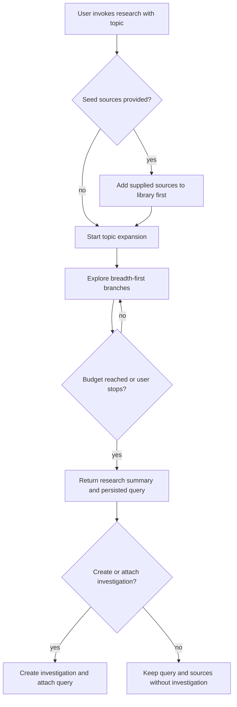

# Research Flow and Investigation Promotion

## Design Intent

**Context:** `research` gives the agent an exploratory workflow that is broader than [`rk search`](../(DESIGN-003)-Query-Sidecar-And-Search-Synthesis/(DESIGN-003)-Query-Sidecar-And-Search-Synthesis.md) but lighter than an investigation. It should help the user gather and absorb source material around a topic, then ask whether that research should be promoted into a thesis-shaped investigation.

### Goals

- Let the user start from a topic or a small set of seed sources without pre-creating an investigation
- Make breadth-first exploration feel agentic and useful without hiding what branches were explored
- Persist enough state that the research pass can be inspected, cited, and reused later
- Ask about investigation creation only after the research pass has produced something worth promoting

### Constraints

- The web is part of the default search surface from the start
- User-provided sources are added first and become ordinary rk library sources before topic expansion continues
- The default stop condition is a source-count budget, with an optional time or effort budget layered on top
- Research does not produce a special one-off synthesis artifact; normal tag syntheses absorb newly added evidence

### Non-goals

- Not a trove-building flow modeled after `swain-search`
- Not a long-lived research workspace separate from the rk library
- Not an automatic investigation creator at invocation time
- Not a replacement for focused, thesis-driven investigation synthesis

## Interaction Surface

The agent-facing `research` workflow from invocation through optional investigation promotion. This includes seed-source intake, progress reporting, stop conditions as presented to the user, and the end-of-run decision about whether to create or attach an investigation.

## User Flow

1. The user invokes `research` with a topic and optionally includes one or more sources.
2. The agent ingests any provided sources first so they join the normal library.
3. The agent expands outward from the initial topic, sampling across related branches before going deeper into any one branch.
4. The agent reports progress in terms the user can evaluate: branches explored, sources added, and budget remaining.
5. When the source budget or optional effort budget is reached, the agent returns a concise summary of what was gathered.
6. The agent asks whether the user wants to create or attach an investigation from this research pass.
7. If the user confirms, the investigation is created and the persisted query is attached. If not, the query and sources remain as normal rk state.

## Screen States

1. **Topic-only start** — the user provides a topic and the agent begins with web-plus-library exploration.
2. **Seeded start** — the user provides one or more sources; the flow acknowledges that those sources are being added before exploration continues.
3. **Active exploration** — the agent is still gathering, reporting major branches and source counts rather than a final thesis.
4. **Budget stop** — the flow stops because the default source budget or optional effort budget has been hit.
5. **Promotion prompt** — the run has produced a persisted query and asks whether it should become part of an investigation.

## Edge Cases and Error States

- **Thin topic:** If the initial topic yields very few useful branches, the flow should say so directly and stop with a small source set rather than pretending broad coverage happened.
- **Partial fetch failure:** Failed branches or unreadable sources are reported as attempted but unsuccessful, without aborting the whole run.
- **Duplicate seed source:** If a user-provided source already exists, the flow treats it as existing context and continues.
- **User declines investigation:** The research run still succeeds; the promotion prompt is optional, not a completion gate.

## Design Decisions

1. `research` asks about investigations at the end, not the beginning. Promotion should be based on gathered evidence, not intent guessed too early.
2. Progress is reported as branch coverage plus source intake, not as a synthesized answer. This keeps the interaction aligned with evidence gathering rather than thesis generation.
3. Seed sources go through the same add path as any other intake. There is no special "temporary research source" mode.
4. The flow complements rather than supersedes [`DESIGN-003`](../(DESIGN-003)-Query-Sidecar-And-Search-Synthesis/(DESIGN-003)-Query-Sidecar-And-Search-Synthesis.md): `search` answers a bounded query, while `research` broadens and populates the field around a topic.

## Assets

- Primary design document: `(DESIGN-010)-Research-Flow-And-Investigation-Promotion.md`

## Lifecycle

| Phase | Date | Commit | Notes |
|-------|------|--------|-------|
| Active | 2026-04-02 | -- | Initial creation |
