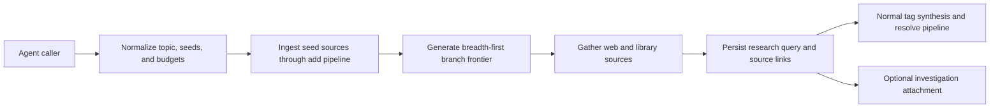

# Research Orchestration and Query Persistence

## Design Intent

**Context:** `research` is an orchestration boundary that sits above source intake and bounded query synthesis. It must harvest broadly around a topic, persist how that harvesting happened, and leave the results inside rk's normal source and query model so later searches, tag syntheses, and investigations can build on them.

### Goals

- Define a first-class persisted research query that records topic expansion, budgets, and resulting sources
- Reuse existing rk ingestion and query infrastructure wherever possible instead of inventing a parallel storage layer
- Keep the research run inspectable after completion by preserving branch provenance and partial-failure truth
- Support optional promotion into an investigation by attaching the persisted query rather than copying research state elsewhere

### Constraints

- The default search surface includes both the existing rk library and outward web gathering
- User-supplied sources are added before expansion and immediately become part of the searchable corpus
- Research persistence centers on the query record plus normal source entries; there is no separate research workspace
- Tag syntheses update through the normal pipeline after sources are added; `research` does not own a dedicated synthesis product

### Non-goals

- Not a reimplementation of `swain-search` troves inside rk
- Not a new storage hierarchy that duplicates sources outside `library/`
- Not a contract for investigation synthesis itself
- Not a promise of exhaustive topic coverage before return

## Interface Surface

The orchestration contract for `research`: how seed sources are ingested, how topic branches are expanded, what gets persisted in the query record, and how the run hands off to normal tag synthesis and optional investigation attachment.

## Contract Definition

`research` behaves as a composed system flow:

1. Normalize the research request into an initial topic plus optional source seeds and budgets.
2. Ingest seed sources through the normal add pipeline.
3. Generate and track expansion branches from the initial topic.
4. Gather sources across the default search surface, preferring breadth across branches before deeper branch-specific drilling.
5. Persist a query record that captures the initial topic, explored branches, selected budgets, gathered sources, and branch-level outcomes.
6. Return a run summary and optionally attach the query to a newly created investigation.

The persisted query is the durable artifact of the run. Sources remain ordinary rk library entries. Investigation creation, when chosen, references the existing query rather than re-owning the research pass.

## Behavioral Guarantees

- Seed-source ingestion happens before branch expansion continues.
- The persisted query records both the original topic and the explored branch structure.
- The run may complete with partial branch failure as long as the persisted record says which branches failed or produced no usable sources.
- Newly gathered sources participate in normal rk search and synthesis after ingestion; `research` does not isolate them in a side channel.
- Investigation promotion is additive: creating an investigation attaches the query rather than changing the underlying source or query ownership model.

## Integration Patterns

- **Intake integration:** source seeds use the existing add pipeline and completion contract.
- **Query integration:** the resulting persisted object extends the query model already described by [`DESIGN-003`](../(DESIGN-003)-Query-Sidecar-And-Search-Synthesis/(DESIGN-003)-Query-Sidecar-And-Search-Synthesis.md), but records exploratory provenance instead of only a bounded retrieval-and-synthesis answer.
- **Investigation integration:** if promoted, the investigation points at the query as one of its evidence-bearing inputs.
- **Synthesis integration:** tag syntheses absorb new evidence through normal rebuild or resolve behavior, not through a research-only synthesis phase.

## Evolution Rules

- Research-query metadata can expand over time with new optional fields for budgets, branch heuristics, and branch outcomes, but should remain backward-compatible with existing query persistence.
- Bounded `search` and exploratory `research` should remain distinct contracts even if they share underlying storage.
- If future versions add resumable research sessions, they should extend the persisted query model rather than introducing a second state container.

## Edge Cases and Error States

- **No useful branches found:** persist a minimal query record with the attempted topic and empty or sparse source results.
- **Branch-level fetch failure:** failed branches are recorded as failed, not silently dropped.
- **Low-novelty continuation:** if an optional effort budget is present, the run may stop early when later passes stop producing distinct value; this is advisory behavior layered on the time or effort budget rather than a user-managed control.
- **Duplicate source collisions:** duplicate detection remains owned by the normal source-ingestion path; `research` consumes that result rather than redefining it.

## Design Decisions

1. The persisted research artifact is a query, not a workspace. This keeps research composable with existing rk storage.
2. Topic expansion provenance is part of the contract, not ephemeral runtime state. Without that, the exploratory run cannot be reviewed or promoted cleanly.
3. [`DESIGN-003`](../(DESIGN-003)-Query-Sidecar-And-Search-Synthesis/(DESIGN-003)-Query-Sidecar-And-Search-Synthesis.md) remains the contract for bounded query synthesis. `DESIGN-011` adds a broader orchestration layer above it.
4. Investigation promotion is a reference operation, not a copy operation. The query stays first-class whether or not an investigation is later created.

## Assets

- Primary design document: `(DESIGN-011)-Research-Orchestration-And-Query-Persistence.md`

## Lifecycle

| Phase | Date | Commit | Notes |
|-------|------|--------|-------|
| Active | 2026-04-02 | -- | Initial creation |
