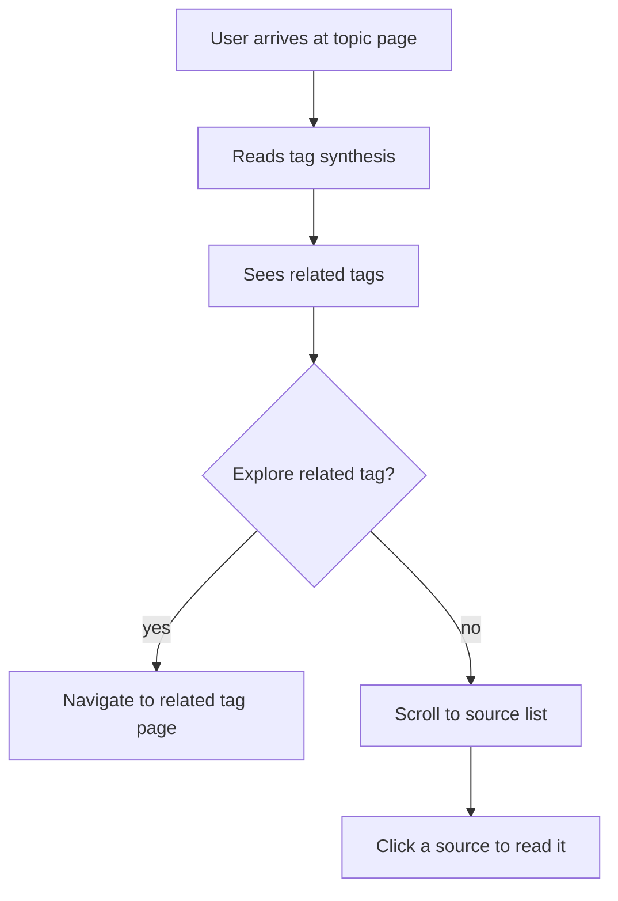

# Topic Detail Page

## Design Intent

**Context:** The topic detail page is what the user sees when they click a tag from the homepage topics list. It is the primary destination for J3 (browse) stages 3-5 and J1 stage 4.

### Goals

- Show the tag's synthesis as the primary reading content
- List sources under this tag
- Surface related tags with shared-source counts (tag intersections) for serendipitous discovery
- Indicate synthesis freshness

### Constraints

- Must render from rk's tag directory structure (meta.yaml + synthesis.md + sources/ symlinks)
- WCAG AA compliance
- Same visual language as homepage (warm off-white, Georgia serif for reading)

### Non-goals

- Not an editing interface
- Not a graph visualization (though related-tags section could use one in the future)
- Not a faceted search interface (selecting tags here navigates, doesn't filter)

## Interaction Surface

The tag detail page in the rk viewer. Reached by clicking a tag name from the homepage topics list, from a tag pill on a source card, or via deep link.

## User Flow

Placeholder -- needs prototype iteration.

```
1. User arrives at topic page (e.g., "Navigation Technology")
2. Reads the tag synthesis (primary content)
3. Sees related tags with shared-source counts
4. Clicks a related tag to navigate to that topic (or to an intersection view?)
5. Scrolls down to see sources under this tag
6. Clicks a source to read it
```



## Screen States

Placeholder -- at minimum:

- **Populated:** Synthesis present, multiple sources, related tags visible
- **Sparse:** 1-2 sources, no synthesis yet
- **Stale synthesis indicator:** Synthesis exists but newer sources have been added since last generation

## Edge Cases and Error States

Placeholder.

## Design Decisions

- **Open question:** Should clicking a related tag navigate to that tag's page, or show the intersection (sources shared between both tags)? The intersection view would be more novel but requires another page design.
- **Open question:** Should the synthesis be above or alongside the source list? Above is simpler but may push sources below the fold.
- **Open question:** What does the "related tags" visualization look like? Observatory mockup used pills with shared-source counts. Spatial map used overlap zones. Pills are simpler for v1.

## Assets

v7-observatory.html detail panel is the closest reference.

## Lifecycle

| Phase | Date | Commit | Notes |
|-------|------|--------|-------|
| Proposed | 2026-03-31 | _pending_ | Initial creation |
