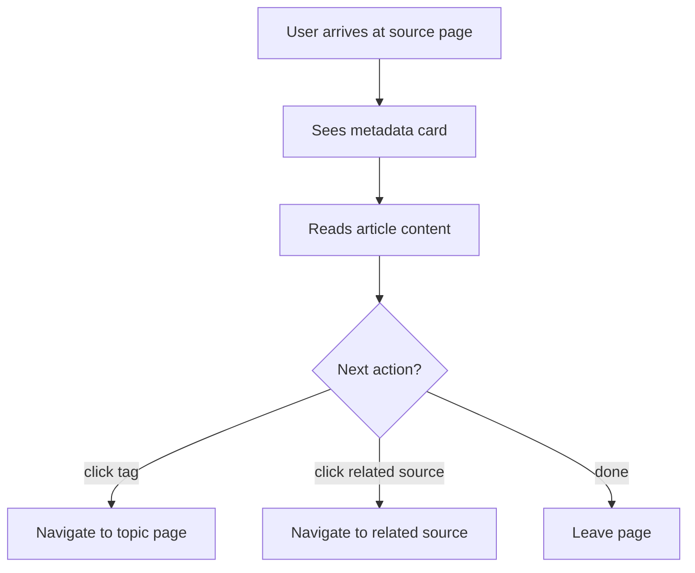

# Source Reading Page

## Design Intent

**Context:** The source reading page displays a single source's full content with its metadata and connections to the rest of the knowledge base.

### Goals

- Readable long-form article layout optimized for comprehension
- Metadata (provenance, tags, ingestion date) presented as a card without overwhelming the content
- Tag links navigate to topic pages
- Related sources (via shared tags) provide onward navigation

### Constraints

- Must render source markdown to HTML faithfully (code blocks, tables, images)
- WCAG AA compliance
- Max reading width ~680px for optimal line length
- Same visual language as homepage

### Non-goals

- Not an editor
- No annotation or highlighting
- No inline commenting

## Interaction Surface

The source detail/reading page in the rk viewer. Reached by clicking a source title from the homepage feed, topic page source list, investigation detail, or search results.

## User Flow

Placeholder -- needs prototype iteration.

```
1. User arrives at source page
2. Sees metadata card (title, URL, tags, ingestion date)
3. Reads the article content
4. At bottom (or sidebar): sees "related sources" -- other sources sharing tags with this one
5. Clicks a tag to go to the topic page
6. Clicks a related source to read it
```



## Screen States

Placeholder.

## Edge Cases and Error States

Placeholder -- consider:

- Very long articles
- Articles with many images
- Articles with no tags

## Design Decisions

- **Open question:** Sidebar with metadata + related sources, or metadata header + related sources at the bottom? Sidebar keeps the metadata visible while reading but narrows the content.
- **Open question:** Should the source page show which investigations and queries cite this source?

## Assets

None yet -- needs its own prototype.

## Lifecycle

| Phase | Date | Commit | Notes |
|-------|------|--------|-------|
| Proposed | 2026-03-31 | _pending_ | Initial creation |
