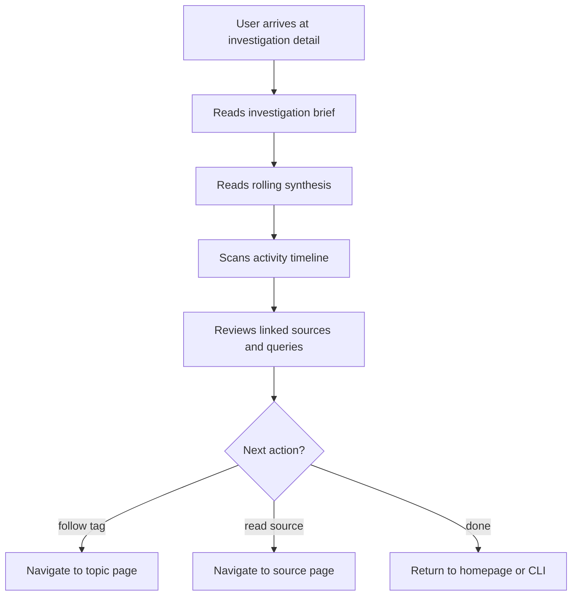

# Investigation Detail Page

## Design Intent

**Context:** The investigation detail page is the primary destination for J2 (pick up an investigation). It must reorient the returning researcher on where they left off and what's changed.

### Goals

- Show the investigation brief and rolling synthesis prominently
- Display linked sources, queries, and tags with enough detail to understand without clicking into each
- Provide an activity timeline showing when sources were added and queries were run
- Surface "new since last visit" signals

### Constraints

- Must render from rk's investigation directory structure
- WCAG AA compliance
- Read-only in phase 1
- Same visual language as homepage

### Non-goals

- Not an investigation management interface (create/pause/close done via CLI)
- Not a real-time collaborative workspace (that's phase 3)
- No editing of the investigation brief or synthesis

## Interaction Surface

The investigation detail page in the rk viewer. Reached by clicking an investigation card from the homepage activity feed, or via deep link from the CLI/TUI.

## User Flow

Placeholder -- based on JOURNEY-002 stages.

```
1. User arrives at investigation detail (e.g., "Fog Signal Technology Evolution")
2. Reads the brief for orientation
3. Reads the rolling synthesis -- checks if it reflects latest sources
4. Scans the activity timeline to see what happened recently
5. Reviews linked sources and queries
6. Follows a linked tag to check for new sources
7. Notes relevant new sources for future addition via CLI
```



## Screen States

Placeholder -- at minimum:

- **Active investigation (full):** Brief, synthesis, sources, queries, timeline all populated
- **Paused investigation:** Stale signals visible, synthesis may be outdated
- **New investigation:** Brief only, no sources yet
- **Investigation with many sources:** Scrolling/pagination needed

## Edge Cases and Error States

Placeholder -- consider:

- Stale synthesis (sources added but synthesis not regenerated)
- Investigation with no queries
- Very long activity timelines

## Design Decisions

- **Open question:** How to signal "new since last visit"? Per-user tracking requires state. Could use timestamps relative to synthesis-last-updated instead.
- **Open question:** Activity timeline -- inline chronological list or a visual timeline? The homepage investigation card already has a "Last session" callout -- this page needs the full history.
- **Open question:** How much of the synthesis to show before scrolling to sources/queries? Full synthesis could be very long.

## Assets

Homepage investigation card (v10-fluid.html) is the starting point -- the detail page expands on that card's content.

## Lifecycle

| Phase | Date | Commit | Notes |
|-------|------|--------|-------|
| Proposed | 2026-03-31 | _pending_ | Initial creation |
