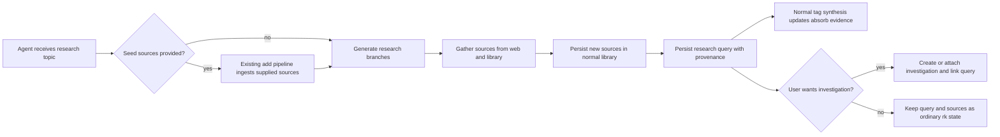

# Architecture Overview

`EPIC-008` adds an exploratory orchestration layer above existing rk intake, query, and investigation primitives. The new behavior is not a second storage model. It composes existing source ingestion and query persistence so that a research run can broaden around a topic, record how it did so, and optionally become part of an investigation.

## Architectural Scope

- **Research invoker** — the agent-facing entry point that receives a topic, optional seed sources, and optional budgets
- **Seed intake path** — existing add pipeline used to ingest provided sources before research expansion begins
- **Branch planner** — expands outward from the topic breadth-first and tracks which branches were explored
- **Source gatherer** — queries both the existing library and the web, turning useful findings into ordinary rk sources
- **Research query persistence** — records the topic, branch provenance, budgets, and linked result sources as a first-class query artifact
- **Investigation promoter** — optionally creates or attaches an investigation that references the persisted query

## Flow

## Integration Notes

- Research-query persistence should extend the existing query model rather than fork it.
- Duplicate detection, normalization, and source storage remain owned by the existing add path.
- Investigation promotion is a reference operation: the investigation points at the query instead of copying the research run into a second container.
