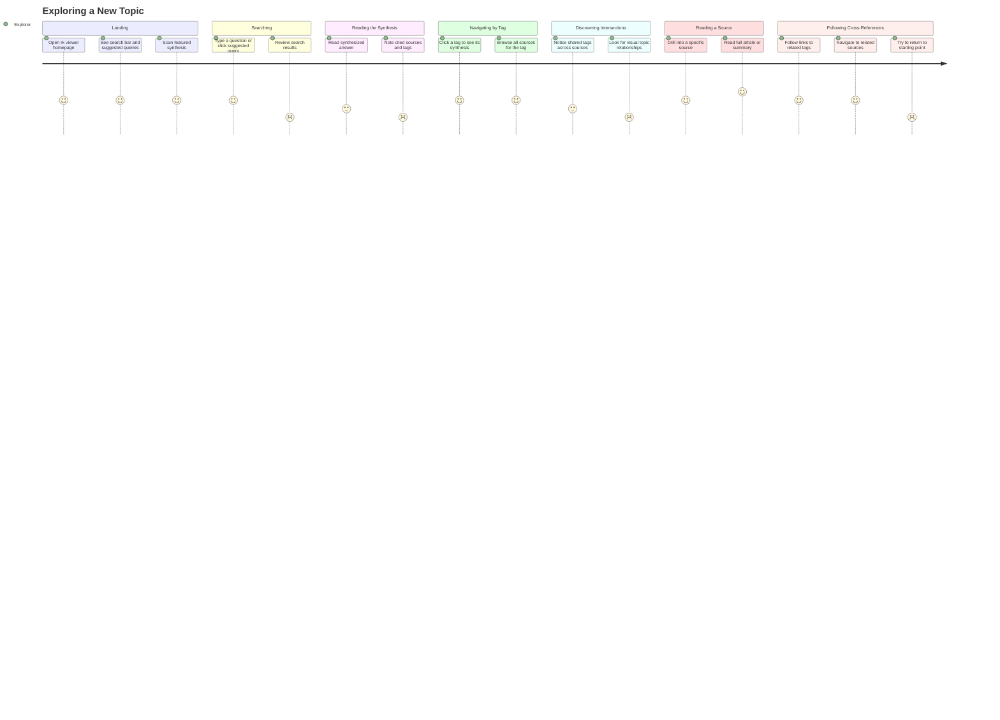

# Exploring a New Topic

## Persona

**PERSONA-005 — The Explorer** (Knowledge Browser / Reader archetype). Someone who interacts with an rk instance exclusively through the viewer. They open the rk viewer to learn about a topic they haven't investigated before, wanting to understand what the knowledge base knows and discover connections they wouldn't find through raw search alone.

## Goal

Explore an unfamiliar topic through the rk viewer, moving from an initial question to a rich understanding of how sources and tags relate, ultimately finding specific articles worth reading in depth.

## Steps / Stages

### Stage 1: Landing

The explorer opens the rk viewer homepage. They see a search bar, a set of suggested queries drawn from popular tags, and a featured synthesis — a curated summary of a well-connected topic in the knowledge base.

### Stage 2: Searching

The explorer types a question into the search bar or clicks one of the suggested queries. The viewer returns a synthesized answer — a prose summary generated from tagged sources.

> **PP-01:** The search returns nothing useful because the knowledge base is too sparse in this area. The explorer has no way to know whether the topic simply isn't covered or whether their query was poorly formed.

### Stage 3: Reading the Synthesis

The explorer reads the synthesized answer. It cites specific sources by name and shows the tags that connect them. The synthesis gives the explorer a starting orientation in the topic.

> **PP-02:** The synthesis is stale or too generic — it reads like a Wikipedia stub rather than a curated perspective drawn from the actual sources.

### Stage 4: Navigating by Tag

The explorer clicks a tag to see its dedicated synthesis and the full list of sources carrying that tag. This shifts from "answer to my question" to "everything the knowledge base knows about X."

### Stage 5: Discovering Intersections

The explorer notices that several sources share multiple tags — for example, three sources tagged both `architecture` and `historic-preservation`. These intersections reveal thematic clusters the explorer didn't anticipate.

> **PP-03:** There is no visual cue showing how topics relate to each other. Tag intersections are discoverable only by manually comparing source lists.

### Stage 6: Reading a Source

The explorer drills into a specific source to read the full article (or its saved summary). They get the complete context behind what the synthesis cited.

### Stage 7: Following Cross-References

From the source view, the explorer follows cross-references — links to related tags and other sources that share tags with this one. The journey becomes self-directed exploration.

> **PP-04:** The explorer gets lost navigating through tags and sources with no breadcrumb trail or way to return to where they started.

## Pain Points

> **PP-01:** Search returns nothing useful when the knowledge base is sparse in the queried area. The explorer cannot distinguish between "not covered" and "bad query."

> **PP-02:** Synthesis is stale or too generic — reads like filler rather than a curated perspective drawn from actual sources.

> **PP-03:** No visual cue for how topics relate. Tag intersections are only discoverable by manually comparing source tag lists.

> **PP-04:** No breadcrumb or navigation history. The explorer gets lost after several hops through tags and sources.

### Pain Points Summary

| ID | Pain Point | Score | Stage | Root Cause | Opportunity |
|----|------------|-------|-------|------------|-------------|
| PP-01 | Search returns nothing useful on sparse topics | 2 | Searching | Knowledge base coverage gaps; no query feedback | Show coverage indicators; suggest related tags when exact match fails |
| PP-02 | Synthesis is stale or too generic | 2 | Reading the Synthesis | Synthesis not regenerated when sources change; no quality signal | Timestamp synthesis freshness; regenerate on source changes; show source count |
| PP-03 | No visual cue for topic relationships | 2 | Discovering Intersections | Tags displayed as flat lists, not as a graph or matrix | Tag co-occurrence visualization; cluster map; intersection counts on tag pages |
| PP-04 | No breadcrumb or navigation history | 2 | Following Cross-References | Viewer has no session-aware navigation state | Breadcrumb trail; "back to search" button; exploration history sidebar |

## Opportunities

- **Coverage indicators on search:** When a query hits a sparse area, show the explorer what *is* available nearby — related tags, partial matches, and the total source count for adjacent topics.
- **Synthesis freshness signals:** Display when a synthesis was last generated and how many sources contributed. Let the explorer judge whether the synthesis reflects current knowledge.
- **Tag relationship visualization:** A co-occurrence view (graph, matrix, or cluster map) that shows which tags frequently appear together. This turns implicit intersections into an explicit discovery tool.
- **Exploration breadcrumbs:** A persistent trail showing the path the explorer took — search query, tags visited, sources opened — with one-click return to any prior point.

## Lifecycle

| Phase | Date | Commit | Notes |
|-------|------|--------|-------|
| Active | 2026-03-30 | — | Initial creation |
