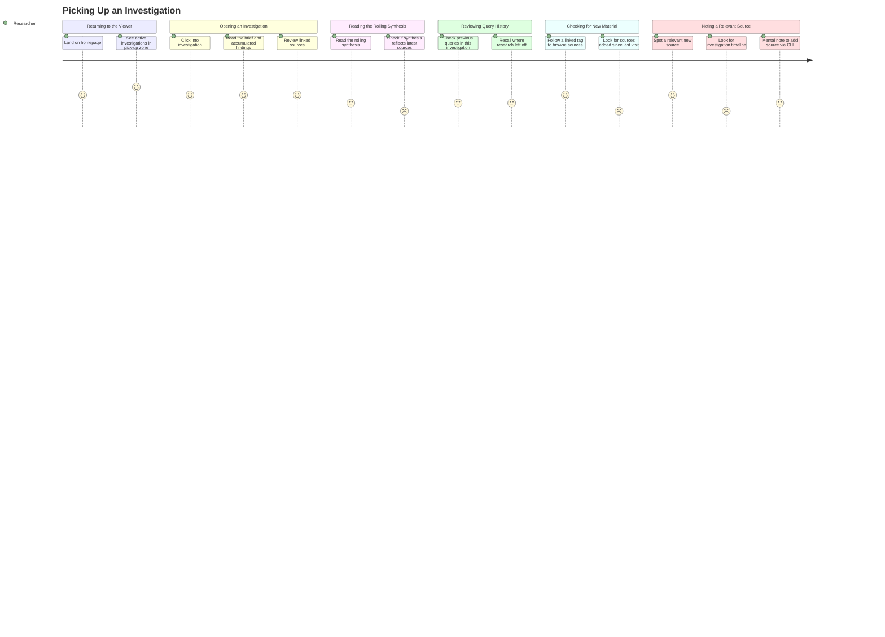

# Picking Up an Investigation

## Persona

**PERSONA-005 — The Explorer** (Knowledge Browser / Reader archetype), or the Tinkerer (PERSONA-002) in reader mode. A researcher who has been using rk to build investigations over time. They return to the viewer to continue work on an active investigation — reviewing accumulated findings, checking for new material, and deciding what to do next.

## Goal

Resume an active investigation in the rk viewer, understand what has changed since the last visit, review the investigation's rolling synthesis, and identify new sources worth incorporating.

## Steps / Stages

### Stage 1: Returning to the Viewer

The researcher lands on the rk viewer homepage. The "pick up" zone shows their active investigations — each with a title, brief, and last-updated timestamp.

### Stage 2: Opening an Investigation

The researcher clicks into an investigation. They see the investigation brief (the original question or thesis), the accumulated findings so far, and the linked sources organized by when they were added.

### Stage 3: Reading the Rolling Synthesis

The investigation has a rolling synthesis — a continuously updated summary that reflects all linked sources. The researcher reads it to get reoriented on the current state of understanding.

> **PP-01:** The rolling synthesis does not reflect recently added sources. The researcher cannot tell whether the synthesis is current or lagging behind the actual source list.

### Stage 4: Reviewing Query History

The researcher checks what queries have been run in this investigation's context — previous searches that contributed sources. This reminds them where they left off and what angles they've already explored.

### Stage 5: Checking for New Material

The researcher follows a linked tag to see if new sources have been added to the knowledge base since their last visit. They want to know: "Has anything new appeared that's relevant to my investigation?"

> **PP-02:** There is no "new since last visit" signal. The researcher cannot distinguish sources they've already reviewed from ones added after their last session.

### Stage 6: Noting a Relevant Source

The researcher spots a recently added source that's relevant to the investigation. In the viewer (read-only), they make a mental note to add it via the CLI later. There's no way to annotate or bookmark from the viewer.

> **PP-03:** The viewer provides no way to see the investigation's timeline — when sources were added, when queries were run, when the synthesis was last regenerated. The investigation feels like a static snapshot rather than an evolving artifact.

## Pain Points

> **PP-01:** The rolling synthesis does not reflect recently added sources. The researcher reads it for reorientation but cannot tell if it's current or stale.

> **PP-02:** No "new since last visit" signal. Sources added after the researcher's last session are indistinguishable from ones they've already reviewed.

> **PP-03:** No investigation timeline. The researcher cannot see when sources were added, when queries were run, or when the synthesis was last regenerated. The investigation looks like a static snapshot.

### Pain Points Summary

| ID | Pain Point | Score | Stage | Root Cause | Opportunity |
|----|------------|-------|-------|------------|-------------|
| PP-01 | Synthesis doesn't reflect recently added sources | 2 | Reading the Rolling Synthesis | Synthesis regeneration is not triggered by source additions | Auto-regenerate synthesis on source change; show "last synthesized" timestamp and source count delta |
| PP-02 | No "new since last visit" signal | 2 | Checking for New Material | Viewer has no per-user session tracking or last-seen marker | Track last-visit timestamp per investigation; badge new sources; highlight changes since last session |
| PP-03 | No investigation timeline | 2 | Noting a Relevant Source | Investigation stores findings but not the history of how they accumulated | Activity log for each investigation showing source additions, query runs, synthesis updates with timestamps |

## Opportunities

- **Synthesis staleness indicator:** Show when the synthesis was last regenerated relative to the most recent source addition. If sources have been added since last synthesis, show a clear "synthesis out of date" notice.
- **"New since" markers:** Track when the researcher last viewed an investigation and badge any sources, tags, or synthesis updates that occurred after that timestamp. This turns the static list into a "what changed" view.
- **Investigation activity timeline:** A chronological log embedded in the investigation view showing when sources were added, queries were run, and synthesis was regenerated. This gives the researcher a narrative of how the investigation evolved.
- **Viewer-side bookmarking:** Even in read-only mode, let the researcher flag a source as "add to investigation" — a lightweight intent marker that the CLI can pick up later.

## Lifecycle

| Phase | Date | Commit | Notes |
|-------|------|--------|-------|
| Active | 2026-03-30 | — | Initial creation |
