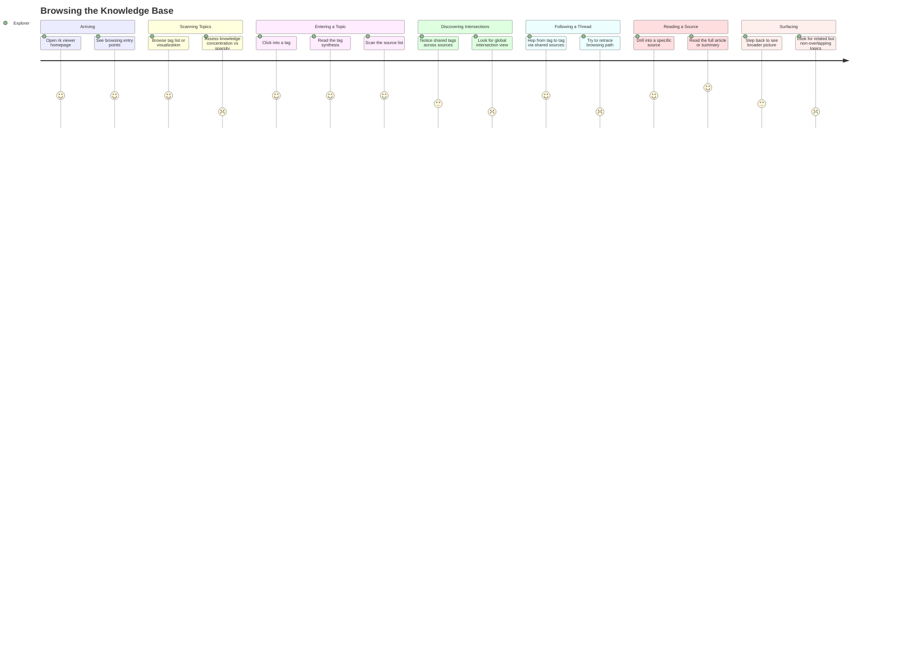

# Browsing the Knowledge Base

## Persona

**PERSONA-005 — The Explorer** (Knowledge Browser / Reader archetype). Someone who opens the rk viewer with no specific question in mind. They want to wander through the knowledge base, discover what topics exist, find unexpected connections, and develop a sense of the overall shape of accumulated knowledge — all outside the context of a specific investigation.

## Goal

Browse the knowledge base without a specific question, discover what's there, find unexpected connections between topics, and develop a mental model of the overall shape and density of accumulated knowledge.

## Steps / Stages

### Stage 1: Arriving

The explorer opens the rk viewer, not looking for anything specific. They want to browse, discover, and get a feel for what has accumulated. The homepage offers entry points — a tag cloud, a recently updated list, or a visualization of the knowledge graph.

### Stage 2: Scanning Topics

The explorer browses the tag list or visualization to see what topics exist and their relative sizes. They get a sense of where knowledge is concentrated (many sources, dense connections) versus sparse (a tag with only one or two sources).

> **PP-01:** No sense of the "shape" of the knowledge base — the explorer cannot see where knowledge is concentrated or sparse without clicking into every tag individually.

### Stage 3: Entering a Topic

The explorer clicks into a tag that catches their interest. They read the tag synthesis — a distilled summary of what the knowledge base knows about this topic. They scan the list of sources that carry this tag.

### Stage 4: Discovering Intersections

The explorer notices which other tags share sources with this one. They follow an intersection — for example, "sources tagged both architecture AND historic-preservation" — to find thematic clusters that cut across topics.

> **PP-02:** Tag intersections are invisible unless the explorer is already inside a tag detail view. There is no global view of which tags overlap or cluster together.

### Stage 5: Following a Thread

The explorer moves from tag to tag via shared sources and intersections. The browsing becomes self-directed exploration — each hop reveals something unexpected. A source about urban planning leads to a tag about public transit, which shares sources with economic policy.

> **PP-03:** No breadcrumb trail — after hopping through several tags and sources, the explorer cannot retrace the path they took or return to a prior branch point.

### Stage 6: Reading a Source

The explorer drills into a specific source for the full article or its saved summary. They read deeply, absorbing the content that caught their attention during the browsing journey.

### Stage 7: Surfacing

The explorer steps back to see the broader picture. They want to understand how what they just read fits into the overall knowledge structure. What other tags does this source carry? What clusters is it part of? How central or peripheral is it?

> **PP-04:** No "related but different" suggestions — the viewer shows what's connected by shared tags but not what's adjacent (topics that are conceptually close but don't actually overlap in sources).

## Pain Points

> **PP-01:** No sense of the "shape" of the knowledge base. The explorer cannot see where knowledge is concentrated or sparse without clicking into every tag. There is no density map, heat map, or sizing cue.

> **PP-02:** Tag intersections are invisible unless already inside a tag detail view. There is no global view showing which tags overlap, cluster together, or bridge between topic areas.

> **PP-03:** No breadcrumb trail. After hopping through several tags and sources, the explorer cannot retrace the path they took or return to a prior decision point in their browsing.

> **PP-04:** No "related but different" suggestions. The viewer shows what's connected by shared tags but not what's adjacent — topics that are conceptually close but don't actually share sources.

### Pain Points Summary

| ID | Pain Point | Score | Stage | Root Cause | Opportunity |
|----|------------|-------|-------|------------|-------------|
| PP-01 | No sense of the "shape" of the knowledge base | 2 | Scanning Topics | Tags displayed as flat lists with no density or sizing cues | Tag cloud with size proportional to source count; heat map or density visualization; sparkline indicators |
| PP-02 | Tag intersections invisible outside tag detail view | 2 | Discovering Intersections | Intersections computed only within a single tag's context; no global co-occurrence view | Global tag co-occurrence matrix or graph; cluster visualization on the browse landing page |
| PP-03 | No breadcrumb trail for browsing path | 2 | Following a Thread | Viewer has no session-aware navigation state or history | Breadcrumb trail; exploration history sidebar; "back to" shortcuts at each hop |
| PP-04 | No "related but different" suggestions | 2 | Surfacing | Viewer only shows explicit tag overlap, not semantic adjacency | Semantic similarity suggestions; "topics near this one" based on embedding proximity rather than shared tags |

## Opportunities

- **Knowledge density visualization:** A tag cloud, heat map, or graph view where tag size or color intensity reflects the number of sources and connections. This gives the explorer an immediate sense of where knowledge is concentrated and where it's thin, without clicking into anything.
- **Global co-occurrence view:** A matrix or graph visualization showing which tags frequently co-occur across sources. This makes intersections visible before the explorer enters any specific tag, enabling more intentional browsing.
- **Exploration breadcrumbs:** A persistent trail or sidebar showing the path the explorer has taken — tags visited, sources opened, intersections followed — with one-click return to any prior point. This turns undirected browsing into a replayable journey.
- **Semantic adjacency suggestions:** Beyond shared tags, suggest topics that are semantically close based on embedding similarity. "You're browsing architecture — you might also be interested in urban planning, which doesn't share tags but covers adjacent territory."

## Lifecycle

| Phase | Date | Commit | Notes |
|-------|------|--------|-------|
| Active | 2026-03-30 | — | Initial creation |
