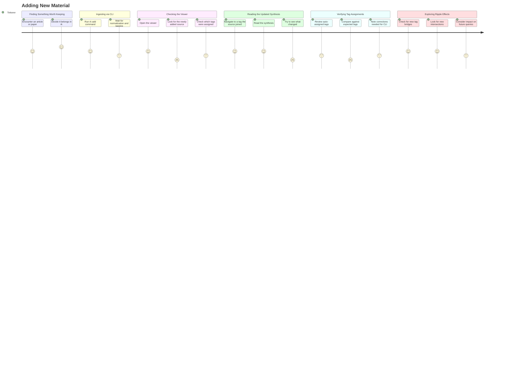

# Adding New Material

## Persona

**PERSONA-002 — The Tinkerer** (Builder / Operator archetype). A hands-on user who runs their own rk instance. They encounter material worth keeping — an article, paper, video, or note — and want to add it to the knowledge base and see how it integrates: which tags apply, which existing syntheses it updates, and what new connections it creates.

## Goal

Add a new source to the knowledge base via the CLI and then use the viewer to verify how it integrated — confirming tag assignments, reading updated syntheses, and exploring what new connections the source created.

## Steps / Stages

### Stage 1: Finding Something Worth Keeping

The tinkerer encounters an article, paper, video, or note worth adding to rk. They have it as a URL, file, or text. The decision to keep it is immediate — they've read enough to know it belongs in their knowledge base.

### Stage 2: Ingesting via CLI

The tinkerer runs `rk add <url>` or similar. The CLI handles fetching, normalization, embedding, auto-tagging, and synthesis updates. This stage happens entirely in the terminal, outside the viewer.

### Stage 3: Checking the Viewer

The tinkerer opens the viewer to see where the new source landed. Which tags were assigned? Did it join existing tag clusters or create a new one? They want a quick confirmation that the ingestion worked and the source is visible.

> **PP-01:** No "what changed" view — after ingesting a source, the viewer does not highlight what's new or what syntheses were updated. The tinkerer must manually search for the source they just added.

### Stage 4: Reading the Updated Synthesis

The tinkerer navigates to a tag the source was assigned to. They read the updated synthesis to see how the new source changed the understanding — did it add a new facet, reinforce an existing point, or introduce a contrasting perspective?

> **PP-02:** No "before/after" for syntheses — the tinkerer cannot see how the synthesis changed when the new source was added. The synthesis reads as if it always included this source.

### Stage 5: Verifying Tag Assignments

The tinkerer checks whether the auto-assigned tags make sense. Are there tags that should have been assigned but weren't? Are there tags that were assigned incorrectly? If adjustments are needed, they make a mental note to fix via CLI.

> **PP-03:** Cannot tell if auto-tagging was accurate from the viewer alone — the tinkerer has to mentally compare the assigned tags against what they'd expect based on the source content. No confidence score or rationale is shown.

### Stage 6: Exploring Ripple Effects

The tinkerer follows connections from the new source. Does it bridge two previously disconnected tags? Does it create a new intersection that didn't exist before? Does it change which queries would now be answered differently?

## Pain Points

> **PP-01:** No "what changed" view. After ingesting a source, the viewer does not highlight what's new or what syntheses were updated. The tinkerer must manually search for the source they just added, with no visual distinction between new and existing content.

> **PP-02:** No "before/after" for syntheses. The tinkerer cannot see how the synthesis changed when the new source was added. There is no diff view, no changelog, and no indication of which sentences or paragraphs are new.

> **PP-03:** Cannot tell if auto-tagging was accurate from the viewer. The tinkerer has to mentally compare assigned tags against what they'd expect. No confidence score, rationale, or suggested alternatives are shown.

### Pain Points Summary

| ID | Pain Point | Score | Stage | Root Cause | Opportunity |
|----|------------|-------|-------|------------|-------------|
| PP-01 | No "what changed" view after ingestion | 2 | Checking the Viewer | Viewer has no concept of recency or change tracking; all sources displayed uniformly | "Recently added" badge or section; highlight newly affected tags and syntheses; ingestion receipt linking to what changed |
| PP-02 | No "before/after" for syntheses | 2 | Reading the Updated Synthesis | Synthesis regeneration overwrites previous version with no history | Synthesis version history; diff view showing what changed; changelog annotation per source addition |
| PP-03 | Cannot verify auto-tagging accuracy from viewer | 2 | Verifying Tag Assignments | Auto-tagging runs without exposing its reasoning or confidence to the user | Show tagging confidence scores; display rationale for each tag assignment; suggest alternative tags the system considered |

## Opportunities

- **Ingestion receipt in viewer:** After adding a source via CLI, the viewer shows a "what changed" summary — the new source, which tags it was assigned to, which syntheses were regenerated, and whether any new tag intersections were created. This gives the tinkerer immediate feedback without hunting.
- **Synthesis version history:** Maintain previous versions of each synthesis. The viewer offers a diff view showing what changed when a new source was incorporated — new sentences highlighted, removed content struck through, unchanged content dimmed.
- **Tagging transparency:** For each auto-assigned tag, show a confidence score and a brief rationale ("assigned because the source mentions X, Y, Z which are core terms for this tag"). Show tags the system considered but rejected, so the tinkerer can override if the system was wrong.
- **Ripple effect visualization:** After ingestion, show a "ripple" view — which tags were affected, which syntheses changed, and whether the new source created any bridges between previously disconnected topic areas.

## Lifecycle

| Phase | Date | Commit | Notes |
|-------|------|--------|-------|
| Active | 2026-03-30 | — | Initial creation |
