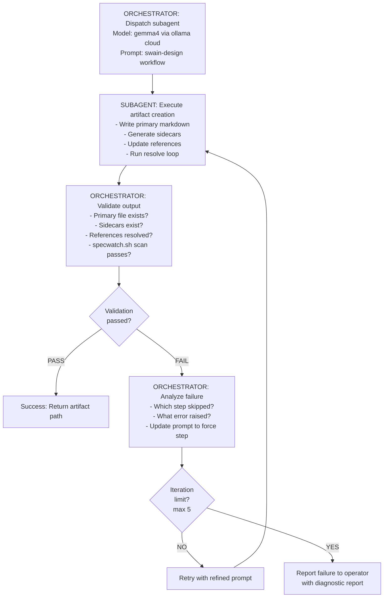

# Lower-Weight Models Skip Artifact Creation Workflow Steps

## Problem Statement

Lower-weight models (e.g., gemma4) are not completing the full artifact creation workflow defined in swain-design SKILL.md. They skip critical steps: filling in sidecar files, updating file/location references, and running resolve operations in a loop. This results in incomplete artifacts that break downstream tooling and require manual intervention to fix.

## Desired Outcomes

All models, regardless of size or capability tier, produce complete artifacts that pass validation. The artifact creation workflow should either complete fully or fail explicitly with clear error messages, rather than silently skipping steps.

## External Behavior

**Current broken behavior:**
- Lower-weight models create the primary artifact markdown file but skip:
  - Sidecar file generation (e.g., `.sidecar.yaml`, metadata files)
  - File/location reference updates across the artifact tree
  - Resolve operations that should run in iterative loops until convergence
- No error is raised — the artifact appears valid but is incomplete
- Downstream tools (specwatch, chart.sh, resolve-artifact-link.sh) fail or produce incorrect output

**Expected behavior:**
- All workflow steps execute to completion regardless of model tier
- If a step cannot complete, the operation fails explicitly with:
  - Clear error message identifying the failed step
  - Partial state is rolled back or marked as incomplete
  - Operator is notified before committing incomplete artifacts

## Acceptance Criteria

1. **Given** a lower-weight model is invoked for artifact creation, **when** the workflow executes, **then** all steps defined in swain-design SKILL.md complete (sidecar generation, reference updates, resolve loops).

2. **Given** a step in the workflow cannot complete, **when** the model encounters an error, **then** it raises an explicit failure with a descriptive error message instead of silently skipping.

3. **Given** an artifact created by a lower-weight model, **when** validated with `specwatch.sh scan`, **then** no warnings about missing sidecars or unresolved references appear.

4. **Given** the resolve operation should iterate, **when** the model runs it, **then** it loops until convergence (no new resolutions found) or hits a defined iteration limit.

5. **Given** an incomplete artifact from a previous run, **when** the workflow is re-run, **then** it detects the incomplete state and either completes the missing steps or reports them to the operator.

## Reproduction Steps

1. Invoke swain-design with a lower-weight model (e.g., gemma4) to create an artifact
2. Observe the model output — it will claim completion after writing only the primary markdown file
3. Run `specwatch.sh scan` on the created artifact — warnings appear about missing sidecars or unresolved references
4. Check for sidecar files — they are missing
5. Check artifact references — they are not updated

## Severity

high — breaks artifact integrity and downstream tooling

## Expected vs. Actual Behavior

**Expected:** All workflow steps execute fully, artifacts are complete with sidecars and resolved references.

**Actual:** Lower-weight models skip sidecar generation, reference updates, and resolve loops, producing incomplete artifacts.

## Verification

| Criterion | Evidence | Result |
|-----------|----------|--------|
| 1 | Test run with gemma4 showing all steps complete | Pending |
| 2 | Error message output when step fails | Pending |
| 3 | specwatch.sh scan output with zero warnings | Pending |
| 4 | Resolve loop iteration logs showing convergence | Pending |
| 5 | Re-run detection of incomplete state | Pending |

## Scope & Constraints

- This bug affects all artifact types (SPEC, EPIC, ADR, etc.) when created by lower-weight models
- Fix should not degrade performance for higher-tier models
- Discovery loop uses ollama cloud for subagent execution — requires network access
- Maximum 5 discovery iterations before failing to operator (prevents infinite loops)
- Solution involves:
  - Explicit step-by-step prompting that forces sequential execution
  - Validation checks after each step before proceeding
  - Model-tier detection that adjusts prompting strategy
  - Orchestrator script that manages subagent lifecycle
- Does not address unrelated model quality issues (prose quality, reasoning depth)
- Discovery loop is only invoked for lower-weight models (gemmas, phi, etc.) — detected via model name pattern

## Implementation Approach

**Discovery loop using subagents (gemma4 via ollama cloud):**

The fix requires an iterative discovery process where subagents running gemma4 attempt artifact creation while the orchestrator observes failures and refines prompting. This loop continues until the workflow completes fully.

**Discovery loop structure:**

**Discovery loop implementation:**

1. **Orchestrator script** (`scripts/discovery-loop.sh`):
   - Accepts: artifact type, title, model name (default: gemma4)
   - Maintains iteration counter (max 5)
   - Tracks which steps failed in previous iterations
   - Builds progressively stricter prompts based on failure history
   - Dispatches subagent via ollama cloud API
   - Validates output after each iteration
   - Returns: success with artifact path, or failure with diagnostic report

2. **Subagent prompt template**:
   - Includes full swain-design SKILL.md workflow
   - Explicit step-by-step checklist with confirmation requirements
   - Forces sequential execution: "Complete step N before proceeding to step N+1"
   - Requires explicit confirmation: "Reply 'STEP 1 COMPLETE' before continuing"
   - Includes validation commands to run after each step

3. **Validation hooks** (run after each subagent completes):
   - `test -f <sidecar-path>` — sidecar files exist
   - `grep -q "resolved" <artifact>` — references updated
   - `specwatch.sh scan <artifact>` — zero warnings
   - All checks must pass before loop exits

4. **Failure analysis**:
   - If sidecar missing: add explicit sidecar generation step with file path
   - If references not updated: add reference update step with grep verification
   - If resolve didn't loop: add iteration counter requirement ("run resolve 3 times minimum")
   - If no error on failure: add explicit error-raising step

**TDD cycles:**

1. **Test: Workflow step detection** — Create a test that invokes artifact creation with a lower-weight model mock and asserts all workflow steps are called. Implement step-tracking middleware or enhanced prompting.

2. **Test: Sidecar generation** — Test that sidecar files are created with correct structure. Implement mandatory sidecar generation step with post-write validation.

3. **Test: Reference resolution loop** — Test that resolve operations iterate until convergence. Implement iteration counter and convergence check in the resolve workflow.

4. **Test: Error propagation** — Test that failures in any step produce explicit errors. Implement try-catch wrappers around each workflow step with rollback on failure.

5. **Test: Discovery loop convergence** — Test that the discovery loop completes within 5 iterations for typical artifact types. Implement iteration counter and failure analysis.

**Implementation order:**
1. Add workflow step tracking to swain-design skill (logging or state file)
2. Add post-step validation hooks that gate progression
3. Enhance resolve operation with explicit loop detection
4. Add model-tier detection and adaptive prompting (if needed)
5. Implement discovery loop orchestrator script
6. Implement subagent prompt templates with step confirmation
7. Add validation hooks for each workflow step
8. Add failure analysis and prompt refinement logic

## Lifecycle

| Phase | Date | Commit | Notes |
|-------|------|--------|-------|
| Proposed | 2026-04-07 | — | Initial creation |
